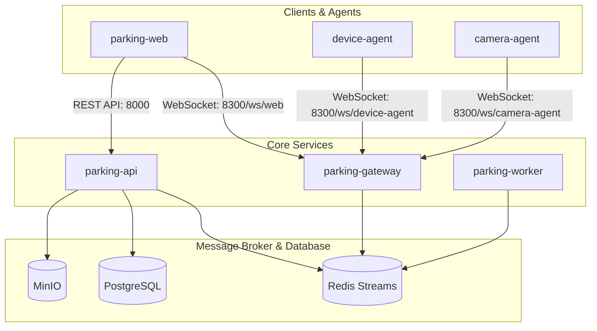

# Smart Parking System

Hệ thống quản lý bãi xe thông minh được thiết kế theo kiến trúc Microservices, hỗ trợ giám sát realtime, tự động nhận diện biển số (ALPR) và điều khiển các thiết bị ngoại vi (đầu đọc thẻ RFID, barrier).

---

## 1. Kiến trúc hệ thống tổng quan

Tất cả kết nối realtime và quản lý phần cứng (agents, web client) được đi qua `parking-gateway` thông qua WebSocket. `parking-gateway` đóng vai trò chuyển tiếp sự kiện nghiệp vụ vào Redis Streams để `parking-api` và các Workers xử lý.

---

## 2. Danh sách các Service

| Service | Cổng (Port) | Mô tả |
|---|---|---|
| `parking-web` | `3000` | Giao diện quản trị, giám sát check-in, check-out realtime sử dụng Vue 3. |
| `parking-api` | `8000` | Core service xử lý business logic (REST APIs), quản lý database PostgreSQL. |
| `parking-gateway` | `8300` | Gateway xử lý WebSocket, quản lý kết nối realtime và định tuyến event từ agent/web. |
| `parking-device-agent` | - | Chạy tại Guard PC, kết nối và điều khiển RFID Reader, Barcode Reader, Barrier. |
| `parking-camera-agent` | - | Chạy tại Guard PC hoặc server, kết nối RTSP Camera, chụp ảnh snapshot, ghi video. |
| `parking-worker` | - | Celery workers xử lý các tác vụ background nặng: OCR, ALPR (nhận diện biển số). |

---

## 3. Tài liệu hướng dẫn chi tiết

Các tài liệu chi tiết về hệ thống được đặt trong thư mục `docs/`:

* **Kiến trúc tổng quan**: [docs/ARCHITECTURE.md](file:///home/thanhhai14/Data/Code/parking-app/docs/ARCHITECTURE.md)
* **Thiết kế cơ sở dữ liệu**: [docs/DATABASE.md](file:///home/thanhhai14/Data/Code/parking-app/docs/DATABASE.md)
* **Hướng dẫn triển khai**: [docs/DEPLOYMENT.md](file:///home/thanhhai14/Data/Code/parking-app/docs/DEPLOYMENT.md)
* **Giám sát & Vận hành**: [docs/OBSERVABILITY.md](file:///home/thanhhai14/Data/Code/parking-app/docs/OBSERVABILITY.md)
* **Chiến lược Kiểm thử**: [docs/TESTING.md](file:///home/thanhhai14/Data/Code/parking-app/docs/TESTING.md)
* **Phục hồi Thảm họa**: [docs/DISASTER_RECOVERY.md](file:///home/thanhhai14/Data/Code/parking-app/docs/DISASTER_RECOVERY.md)
* **Hướng dẫn Dev Cục bộ**: [docs/LOCAL_DEV.md](file:///home/thanhhai14/Data/Code/parking-app/docs/LOCAL_DEV.md)
* **Sơ đồ cấu trúc thư mục**: [docs/Project_Tree.md](file:///home/thanhhai14/Data/Code/parking-app/docs/Project_Tree.md)
* **Tài liệu các Service**:
  * [Parking Gateway Docs](file:///home/thanhhai14/Data/Code/parking-app/docs/services/gateway.md)
  * [Parking API Docs](file:///home/thanhhai14/Data/Code/parking-app/docs/services/api.md)
  * [Parking Web Docs](file:///home/thanhhai14/Data/Code/parking-app/docs/services/web.md)
  * [Device Agent Docs](file:///home/thanhhai14/Data/Code/parking-app/docs/services/device-agent.md)
  * [Camera Agent Docs](file:///home/thanhhai14/Data/Code/parking-app/docs/services/camera-agent.md)
  * [Worker Docs](file:///home/thanhhai14/Data/Code/parking-app/docs/services/worker.md)
