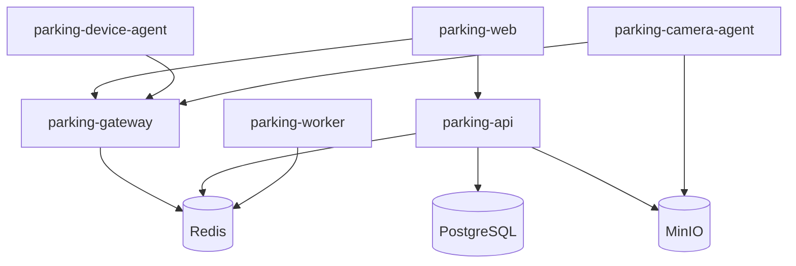
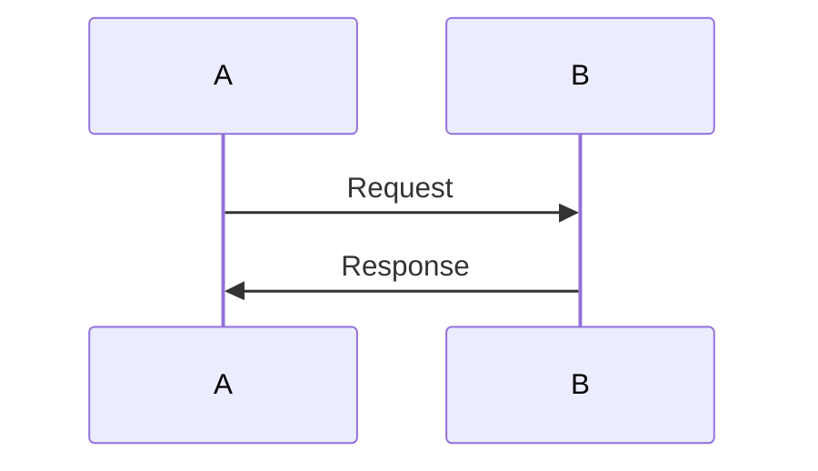

# docs/CONTRIBUTING.md

# Contributing Guide

## 1. Giới thiệu

Cảm ơn bạn đã quan tâm đến việc đóng góp cho **Parking System**.

Parking System là dự án open-source quản lý bãi xe, hỗ trợ:

* Web app quản lý gửi xe
* RFID / thẻ từ
* Camera IP / RTSP / USB
* Check-in / check-out phương tiện
* Barrier
* OCR / ALPR biển số
* Plugin thiết bị
* Docker deployment
* Event-driven architecture

Tài liệu này hướng dẫn cách đóng góp source code, tài liệu, plugin, bug report và tính năng mới.

---

# 2. Mục tiêu của dự án

Dự án hướng đến việc xây dựng một hệ thống giữ xe mã nguồn mở, có thể triển khai thực tế tại:

```text
Công ty
Nhà máy
Chung cư
Trường học
Bệnh viện
Trung tâm thương mại
Bãi xe độc lập
```

Nguyên tắc phát triển:

```text
Open-source
Modular
Docker-first
Plugin-first
Offline-friendly
Hardware-friendly
Security-first
```

---

# 3. Kiến trúc tổng quan

Trước khi đóng góp code, nên đọc các tài liệu sau:

```text
README.md
docs/ARCHITECTURE.md
docs/DATABASE.md
docs/EVENTS_AND_FLOWS.md
docs/CONFIGURATION.md
docs/PLUGIN_SYSTEM.md
docs/SECURITY.md
```

Kiến trúc chính:



---

# 4. Cấu trúc repository

```text
parking-system/

├── apps/
│   ├── parking-web/
│   ├── parking-api/
│   ├── parking-gateway/
│   ├── parking-device-agent/
│   ├── parking-camera-agent/
│   └── parking-worker/
│
├── config/
│   ├── device-agent.yaml
│   └── camera-agent.yaml
│
├── deploy/
│   ├── nginx/
│   ├── postgres/
│   ├── redis/
│   └── minio/
│
├── docs/
│   ├── ARCHITECTURE.md
│   ├── DATABASE.md
│   ├── EVENTS_AND_FLOWS.md
│   ├── CONFIGURATION.md
│   ├── API_REFERENCE.md
│   ├── PLUGIN_SYSTEM.md
│   ├── SECURITY.md
│   └── CONTRIBUTING.md
│
├── plugins/
│   ├── device/
│   ├── camera/
│   └── worker/
│
├── scripts/
│   ├── start.sh
│   ├── stop.sh
│   ├── backup.sh
│   └── restore.sh
│
├── docker-compose.yml
├── .env.example
├── README.md
└── LICENSE
```

---

# 5. Cách chạy môi trường phát triển

## 5.1. Clone repository

```bash
git clone https://github.com/your-org/parking-system.git

cd parking-system
```

---

## 5.2. Tạo file `.env`

```bash
cp .env.example .env
```

---

## 5.3. Build Docker image

```bash
docker compose build
```

---

## 5.4. Khởi động hệ thống

```bash
docker compose up -d
```

---

## 5.5. Kiểm tra service

```bash
docker compose ps
```

---

## 5.6. Xem log

```bash
docker compose logs -f
```

Xem log một service:

```bash
docker compose logs -f parking-api
```

---

# 6. Chế độ mock

Mặc định môi trường development có thể chạy bằng mock mode.

Trong `.env`:

```env
MOCK_RFID=true
MOCK_CAMERA=true
MOCK_OCR=true
MOCK_ALPR=true
MOCK_BARRIER=true
```

Mock mode giúp contributor phát triển mà không cần:

* Đầu đọc thẻ RFID thật
* Camera thật
* Barrier thật
* GPU
* Model AI thật

---

# 7. Quy trình đóng góp

## 7.1. Fork repository

Fork repository về tài khoản GitHub cá nhân.

---

## 7.2. Tạo branch mới

Quy ước đặt tên branch:

```text
feature/<ten-tinh-nang>
fix/<ten-loi>
docs/<noi-dung-tai-lieu>
refactor/<noi-dung-refactor>
plugin/<ten-plugin>
```

Ví dụ:

```bash
git checkout -b feature/checkin-flow
```

```bash
git checkout -b fix/rfid-serial-timeout
```

```bash
git checkout -b docs/api-reference
```

---

## 7.3. Commit code

Commit message nên rõ ràng.

Format đề xuất:

```text
type(scope): message
```

Ví dụ:

```text
feat(api): add vehicle checkin endpoint
fix(device-agent): handle serial reconnect
docs(security): add agent token rotation guide
refactor(worker): split ocr and alpr tasks
plugin(camera): add rtsp camera plugin
```

---

# 8. Quy ước commit type

| Type     | Ý nghĩa                        |
| -------- | ------------------------------ |
| feat     | Thêm tính năng mới             |
| fix      | Sửa lỗi                        |
| docs     | Sửa tài liệu                   |
| refactor | Refactor code, không đổi logic |
| test     | Thêm hoặc sửa test             |
| chore    | Công việc phụ trợ              |
| build    | Sửa build, Docker, CI          |
| ci       | Sửa pipeline CI/CD             |
| plugin   | Thêm hoặc sửa plugin           |
| security | Sửa vấn đề bảo mật             |

---

# 9. Pull Request

## 9.1. Tiêu đề Pull Request

Nên ngắn gọn, rõ nội dung.

Ví dụ:

```text
feat(api): add manual checkin endpoint
```

```text
plugin(device): add RFID TCP plugin
```

---

## 9.2. Nội dung Pull Request

Pull Request nên có:

```text
Mục tiêu
Thay đổi chính
Cách test
Ảnh chụp màn hình nếu có UI
Breaking changes nếu có
Issue liên quan nếu có
```

Template:

````markdown
## Mục tiêu

Mô tả vấn đề hoặc tính năng cần giải quyết.

## Thay đổi chính

-
-
-

## Cách test

```bash
docker compose build
docker compose up -d
````

## Checklist

* [ ] Code đã được format
* [ ] Đã chạy test
* [ ] Không commit secret
* [ ] Đã cập nhật tài liệu nếu cần
* [ ] Không phá vỡ API hiện tại

## Issue liên quan

Closes #

````

---

# 10. Coding Standards

## 10.1. Python

Dùng cho:

```text
parking-api
parking-gateway
parking-device-agent
parking-camera-agent
parking-worker
````

Quy chuẩn:

```text
Python 3.13+
Type hint
Async-first nếu xử lý I/O
Pydantic cho schema
SQLAlchemy cho ORM
Alembic cho migration
Ruff cho lint
Pytest cho test
```

---

## 10.2. Python naming

Dùng tiếng Anh cho tên class, function, module trong source chính để cộng đồng quốc tế dễ tham gia.

Ví dụ:

```python
class ParkingSessionService:
    pass

async def create_checkin_session():
    pass
```

File tài liệu có thể dùng tiếng Việt.

---

## 10.3. FastAPI Router

Router nên tách theo domain:

```text
auth.py
users.py
vehicles.py
cards.py
parking_sessions.py
devices.py
cameras.py
media.py
reports.py
```

Không gom tất cả endpoint vào một file lớn.

---

## 10.4. Service Layer

Business logic phải nằm trong service layer.

Đúng:

```text
router → schema → service → repository → database
```

Không đúng:

```text
router → database trực tiếp
```

---

## 10.5. Repository Layer

Repository chỉ xử lý database query.

Không để business logic trong repository.

---

# 11. Frontend Standards

Dùng cho:

```text
parking-web
```

Công nghệ:

```text
Vue 3
Vite
TypeScript
Pinia
Vue Router
TailwindCSS
Axios
WebSocket client
```

---

## 11.1. Cấu trúc frontend

```text
src/

├── pages/
├── components/
├── layouts/
├── stores/
├── services/
├── composables/
├── types/
└── utils/
```

---

## 11.2. Nguyên tắc UI

Giao diện phải ưu tiên:

```text
Nhanh
Rõ ràng
Ít thao tác
Dễ dùng cho bảo vệ
Hiển thị lỗi dễ hiểu
Tối ưu màn hình 1366x768 và 1920x1080
```

Màn hình quan trọng nhất:

```text
Check-in
Check-out
Dashboard
Device Monitor
Camera Monitor
```

---

## 11.3. Không để business logic nặng ở frontend

Frontend không tự quyết định:

```text
Tính phí
Cho phép mở barrier
Xác định thẻ hợp lệ
Đóng lượt gửi xe
```

Các logic này phải gọi API.

---

# 12. Database Standards

## 12.1. Migration

Mọi thay đổi database phải có Alembic migration.

Không sửa database thủ công.

```bash
alembic revision --autogenerate -m "add parking sessions table"

alembic upgrade head
```

---

## 12.2. UUID

Các bảng chính dùng UUID làm primary key.

---

## 12.3. Timestamp

Các bảng nên có:

```text
created_at
updated_at
```

Các bảng log/event có thể chỉ cần:

```text
created_at
```

---

## 12.4. Soft delete

Các bảng nghiệp vụ nên ưu tiên soft delete:

```text
is_active
deleted_at
deleted_by
```

Không xóa vật lý nếu dữ liệu có liên quan audit.

---

## 12.5. Không lưu ảnh trong database

Không lưu:

```text
base64
bytea
```

trong PostgreSQL.

Ảnh/video lưu ở MinIO.

Database chỉ lưu metadata.

---

# 13. Event Standards

## 13.1. Business Event

Business event phải đi qua Redis Streams.

Ví dụ:

```text
parking.events
parking.commands
parking.tasks
parking.dead_letters
```

---

## 13.2. Realtime Event

Realtime event cho UI dùng Redis Pub/Sub.

Ví dụ:

```text
parking.realtime
parking.notifications
```

---

## 13.3. Event bắt buộc có

```text
event_id
event_type
source
source_id
correlation_id
payload
created_at
```

---

## 13.4. Idempotency

API phải xử lý event trùng.

Không được tạo 2 parking session chỉ vì nhận lại cùng một `event_id`.

---

# 14. Plugin Contribution

## 14.1. Plugin cần có metadata

Mỗi plugin phải có:

```text
plugin.yaml
```

Ví dụ:

```yaml
name: rfid_serial
display_name: RFID Serial Reader
version: 1.0.0
type: device
category: rfid_reader
description: Đọc thẻ RFID qua Serial port
author: Contributor Name
license: MIT
```

---

## 14.2. Plugin cần có test

Plugin mới cần có test tối thiểu:

```text
Load plugin
Validate config
Health check
Read/write command
Error handling
Mock mode
```

---

## 14.3. Plugin không được truy cập database trực tiếp

Device plugin và camera plugin không được kết nối trực tiếp PostgreSQL.

Plugin chỉ giao tiếp với core service qua interface.

---

## 14.4. Plugin lỗi không được làm crash service

Plugin phải xử lý exception và báo trạng thái lỗi về core.

---

# 15. Security Rules

Contributor không được commit:

```text
.env
private key
JWT secret
agent token
database password
camera password
MinIO secret key
file backup thật
ảnh khách hàng thật
video thật từ production
```

---

## 15.1. Dữ liệu test

Chỉ dùng dữ liệu giả.

Ví dụ:

```text
MOCK-000001
51A-12345
Nguyễn Văn A
0900000000
```

Không dùng dữ liệu khách hàng thật.

---

## 15.2. Báo lỗi bảo mật

Không public issue nếu lỗi bảo mật nghiêm trọng.

Lỗi bảo mật gồm:

```text
Bypass login
Lộ token
Lộ secret
Truy cập ảnh không cần quyền
Mở barrier không cần quyền
SQL injection
Remote code execution
```

Nên báo riêng cho maintainer.

---

# 16. Testing

## 16.1. Backend test

Chạy test:

```bash
docker compose exec parking-api pytest
```

---

## 16.2. Worker test

```bash
docker compose exec worker-ocr pytest
```

---

## 16.3. Frontend test

```bash
docker compose exec parking-web npm run test
```

---

## 16.4. Lint

Python:

```bash
ruff check .
```

Frontend:

```bash
npm run lint
```

---

# 17. Documentation Standards

Tài liệu đặt trong:

```text
docs/
```

Quy ước:

```text
Tên file viết HOA, phân tách bằng dấu gạch dưới
```

Ví dụ:

```text
API_REFERENCE.md
EVENTS_AND_FLOWS.md
PLUGIN_SYSTEM.md
```

---

## 17.1. Tài liệu service

Tài liệu service đặt trong:

```text
docs/services/
```

Ví dụ:

```text
docs/services/api.md
docs/services/gateway.md
docs/services/device-agent.md
```

---

## 17.2. Mermaid

Nếu có sơ đồ, ưu tiên dùng Mermaid.

Ví dụ:



---

# 18. Issue Guidelines

## 18.1. Bug report

Issue bug nên có:

```text
Mô tả lỗi
Kỳ vọng đúng
Kết quả thực tế
Cách tái hiện
Log
Ảnh chụp màn hình
Môi trường
```

Template:

````markdown
## Mô tả lỗi

## Cách tái hiện

1.
2.
3.

## Kết quả thực tế

## Kết quả mong muốn

## Log

```text
paste log here
````

## Môi trường

* OS:
* Docker version:
* Browser:
* Service:

````

---

## 18.2. Feature request

Nên có:

```text
Vấn đề cần giải quyết
Giải pháp đề xuất
Tác động đến service nào
Có cần thay đổi database không
Có cần thay đổi API không
Có cần thay đổi event không
````

---

# 19. Review Checklist

Maintainer nên kiểm tra:

```text
[ ] Code đúng kiến trúc
[ ] Không đưa business logic vào frontend
[ ] Không để plugin truy cập database trực tiếp
[ ] Không làm mất event quan trọng
[ ] Có xử lý lỗi
[ ] Có logging phù hợp
[ ] Không log secret
[ ] Có test
[ ] Có cập nhật tài liệu
[ ] Không breaking change ngoài ý muốn
```

---

# 20. Release Process

## 20.1. Versioning

Dự án dùng SemVer:

```text
MAJOR.MINOR.PATCH
```

Ví dụ:

```text
1.0.0
1.1.0
1.1.1
```

---

## 20.2. Quy tắc tăng version

```text
PATCH: sửa lỗi nhỏ
MINOR: thêm tính năng không phá vỡ tương thích
MAJOR: thay đổi lớn, có breaking change
```

---

## 20.3. Release checklist

```text
[ ] Tất cả test pass
[ ] Docker build pass
[ ] Migration chạy được
[ ] Tài liệu đã cập nhật
[ ] CHANGELOG đã cập nhật
[ ] Không còn secret trong repo
[ ] Image đã được tag
[ ] Release note đã viết
```

---

# 21. Roadmap Contribution

Contributor có thể đóng góp theo các nhóm:

## Backend

```text
Parking API
Fee calculation
Payment
Reports
Audit log
RBAC
```

## Frontend

```text
Dashboard
Check-in UI
Check-out UI
Camera monitor
Device monitor
Reports
```

## Hardware

```text
RFID plugin
Barrier plugin
Relay plugin
Wiegand controller
ZKTeco reader
```

## Camera

```text
RTSP
ONVIF
USB camera
Snapshot
Stream
Record
```

## AI

```text
OCR
ALPR
YOLO
PaddleOCR
InsightFace
Vehicle detection
```

## DevOps

```text
Docker
CI/CD
Monitoring
Backup
Nginx
Kubernetes
```

## Documentation

```text
Install guide
API docs
Plugin guide
Security guide
Examples
```

---

# 22. Code of Conduct

Mọi người tham gia dự án cần:

```text
Tôn trọng người khác
Góp ý có tính xây dựng
Không công kích cá nhân
Không spam
Không đưa dữ liệu thật của khách hàng lên issue
Không chia sẻ secret hoặc thông tin nhạy cảm
```

---

# 23. Tổng kết

Đóng góp tốt cho dự án cần tuân thủ các nguyên tắc:

* Hiểu kiến trúc trước khi code.
* Mỗi service giữ đúng trách nhiệm.
* Business logic nằm ở API.
* Realtime/event routing nằm ở Gateway.
* Thiết bị và camera mở rộng bằng plugin.
* Event quan trọng dùng Redis Streams.
* Realtime UI dùng Redis Pub/Sub.
* Tất cả thay đổi quan trọng phải có test và tài liệu.
* Không commit secret hoặc dữ liệu thật.

Cảm ơn bạn đã đóng góp cho Parking System.
