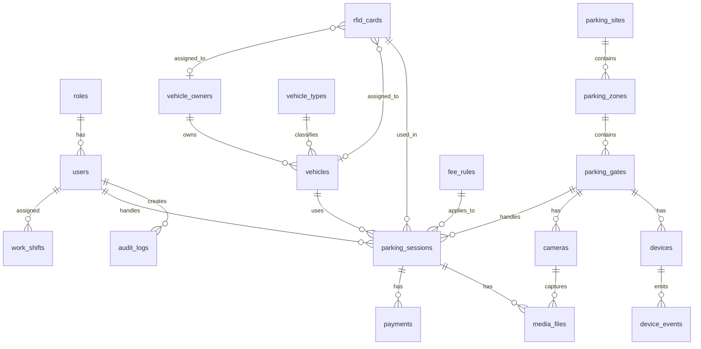
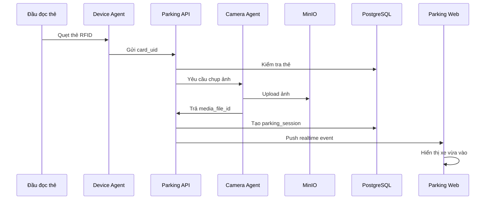
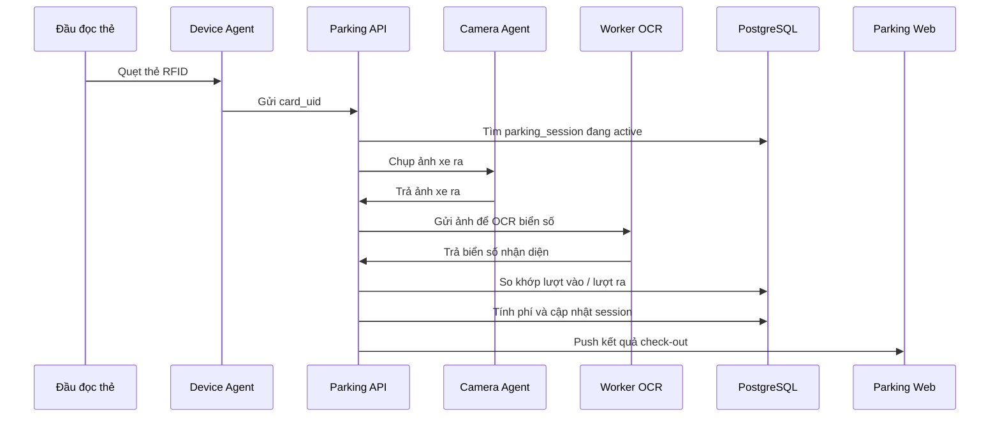

# docs/DATABASE.md

# Thiết kế cơ sở dữ liệu

Tài liệu này mô tả thiết kế database cho hệ thống **Parking System**.

Database chính sử dụng:

```text
PostgreSQL
```

Dữ liệu ảnh, snapshot, video không lưu trực tiếp trong PostgreSQL. Các file media sẽ được lưu ở:

```text
MinIO / S3-compatible Storage
```

PostgreSQL chỉ lưu metadata và đường dẫn object.

---

# 1. Nguyên tắc thiết kế

## 1.1. Tách dữ liệu nghiệp vụ và dữ liệu media

Không lưu ảnh dạng `base64` trong database.

Không lưu ảnh trực tiếp bằng kiểu `bytea` trong PostgreSQL.

Nên lưu như sau:

```text
Ảnh xe vào / xe ra / biển số
        ↓
MinIO bucket
        ↓
PostgreSQL lưu object_key, bucket, mime_type, size
```

Ví dụ:

```text
parking-images/2026/06/17/entry/uuid.jpg
```

---

## 1.2. Mỗi lượt gửi xe là một Parking Session

Một xe vào bãi tạo một bản ghi:

```text
parking_sessions
```

Khi xe ra, cập nhật chính bản ghi đó.

Không nên tách cứng thành bảng `checkin_records` và `checkout_records` độc lập ngay từ đầu, vì dễ bị lệch dữ liệu.

Thiết kế đúng hơn:

```text
parking_sessions
├── entry_time
├── exit_time
├── entry_card_id
├── exit_card_id
├── entry_plate_number
├── exit_plate_number
├── entry_image_id
├── exit_image_id
├── status
```

---

## 1.3. Dùng UUID cho khóa chính

Nên dùng UUID thay vì integer auto increment.

Lý do:

* Dễ đồng bộ nhiều máy
* Dễ chạy offline agent sau này
* Không lộ số lượng bản ghi
* Phù hợp hệ thống phân tán

---

## 1.4. Ghi log đầy đủ

Mọi thao tác quan trọng cần ghi vào:

```text
audit_logs
```

Ví dụ:

* Nhân viên mở barrier thủ công
* Khóa thẻ
* Sửa biển số
* Hủy lượt gửi xe
* Xóa ảnh
* Cấu hình lại camera

---

# 2. Sơ đồ tổng quan database



---

# 3. Danh sách bảng chính

## 3.1. users

Lưu tài khoản người dùng hệ thống.

```sql
CREATE TABLE users (
    id UUID PRIMARY KEY,
    username VARCHAR(100) NOT NULL UNIQUE,
    password_hash TEXT NOT NULL,
    full_name VARCHAR(255) NOT NULL,
    email VARCHAR(255),
    phone VARCHAR(50),
    role_id UUID NOT NULL,
    is_active BOOLEAN DEFAULT TRUE,
    last_login_at TIMESTAMPTZ,
    created_at TIMESTAMPTZ DEFAULT now(),
    updated_at TIMESTAMPTZ DEFAULT now()
);
```

### Ghi chú

`users` dùng cho:

* Admin
* Nhân viên bảo vệ
* Quản lý bãi xe
* Nhân viên kế toán
* Nhân viên kỹ thuật

---

## 3.2. roles

Lưu nhóm quyền.

```sql
CREATE TABLE roles (
    id UUID PRIMARY KEY,
    code VARCHAR(100) NOT NULL UNIQUE,
    name VARCHAR(255) NOT NULL,
    description TEXT,
    permissions JSONB DEFAULT '{}'::jsonb,
    created_at TIMESTAMPTZ DEFAULT now(),
    updated_at TIMESTAMPTZ DEFAULT now()
);
```

Ví dụ `permissions`:

```json
{
  "parking_session.create": true,
  "parking_session.checkout": true,
  "parking_session.cancel": false,
  "device.manage": false,
  "report.view": true
}
```

---

## 3.3. vehicle_owners

Lưu thông tin chủ xe.

```sql
CREATE TABLE vehicle_owners (
    id UUID PRIMARY KEY,
    owner_code VARCHAR(100) UNIQUE,
    full_name VARCHAR(255) NOT NULL,
    owner_type VARCHAR(50) NOT NULL,
    phone VARCHAR(50),
    email VARCHAR(255),
    identity_number VARCHAR(100),
    address TEXT,
    avatar_media_id UUID,
    note TEXT,
    is_active BOOLEAN DEFAULT TRUE,
    created_at TIMESTAMPTZ DEFAULT now(),
    updated_at TIMESTAMPTZ DEFAULT now()
);
```

### owner_type

```text
employee
customer
resident
student
visitor
company
other
```

---

## 3.4. vehicle_types

Lưu loại phương tiện.

```sql
CREATE TABLE vehicle_types (
    id UUID PRIMARY KEY,
    code VARCHAR(100) NOT NULL UNIQUE,
    name VARCHAR(255) NOT NULL,
    description TEXT,
    default_fee_rule_id UUID,
    color VARCHAR(50),
    is_active BOOLEAN DEFAULT TRUE,
    created_at TIMESTAMPTZ DEFAULT now(),
    updated_at TIMESTAMPTZ DEFAULT now()
);
```

Ví dụ:

```text
motorbike
car
truck
electric_bike
bicycle
```

---

## 3.5. vehicles

Lưu thông tin phương tiện.

```sql
CREATE TABLE vehicles (
    id UUID PRIMARY KEY,
    owner_id UUID,
    vehicle_type_id UUID NOT NULL,
    plate_number VARCHAR(50),
    normalized_plate_number VARCHAR(50),
    brand VARCHAR(100),
    model VARCHAR(100),
    color VARCHAR(100),
    description TEXT,
    image_media_id UUID,
    is_active BOOLEAN DEFAULT TRUE,
    created_at TIMESTAMPTZ DEFAULT now(),
    updated_at TIMESTAMPTZ DEFAULT now()
);
```

### normalized_plate_number

Dùng để tìm kiếm biển số không phụ thuộc dấu gạch ngang hoặc khoảng trắng.

Ví dụ:

```text
51A-123.45 -> 51A12345
```

---

## 3.6. rfid_cards

Lưu thẻ RFID, thẻ từ, barcode hoặc QR code.

```sql
CREATE TABLE rfid_cards (
    id UUID PRIMARY KEY,
    card_uid VARCHAR(255) NOT NULL UNIQUE,
    card_number VARCHAR(255),
    card_type VARCHAR(50) NOT NULL DEFAULT 'rfid',
    assigned_vehicle_id UUID,
    assigned_owner_id UUID,
    issued_at TIMESTAMPTZ,
    expired_at TIMESTAMPTZ,
    status VARCHAR(50) NOT NULL DEFAULT 'active',
    note TEXT,
    created_at TIMESTAMPTZ DEFAULT now(),
    updated_at TIMESTAMPTZ DEFAULT now()
);
```

### card_type

```text
rfid
magnetic
barcode
qr
nfc
virtual
```

### status

```text
active
blocked
lost
expired
returned
inactive
```

---

# 4. Cấu trúc bãi xe

## 4.1. parking_sites

Một hệ thống có thể quản lý nhiều bãi xe.

```sql
CREATE TABLE parking_sites (
    id UUID PRIMARY KEY,
    code VARCHAR(100) NOT NULL UNIQUE,
    name VARCHAR(255) NOT NULL,
    address TEXT,
    timezone VARCHAR(100) DEFAULT 'Asia/Ho_Chi_Minh',
    is_active BOOLEAN DEFAULT TRUE,
    created_at TIMESTAMPTZ DEFAULT now(),
    updated_at TIMESTAMPTZ DEFAULT now()
);
```

---

## 4.2. parking_zones

Một bãi xe có nhiều khu vực.

```sql
CREATE TABLE parking_zones (
    id UUID PRIMARY KEY,
    site_id UUID NOT NULL,
    code VARCHAR(100) NOT NULL,
    name VARCHAR(255) NOT NULL,
    capacity INTEGER DEFAULT 0,
    current_count INTEGER DEFAULT 0,
    vehicle_type_id UUID,
    is_active BOOLEAN DEFAULT TRUE,
    created_at TIMESTAMPTZ DEFAULT now(),
    updated_at TIMESTAMPTZ DEFAULT now(),
    UNIQUE(site_id, code)
);
```

Ví dụ:

```text
Tầng hầm B1
Khu xe máy
Khu ô tô
Khu khách
Khu nhân viên
```

---

## 4.3. parking_gates

Cổng ra/vào của bãi xe.

```sql
CREATE TABLE parking_gates (
    id UUID PRIMARY KEY,
    zone_id UUID NOT NULL,
    code VARCHAR(100) NOT NULL,
    name VARCHAR(255) NOT NULL,
    gate_type VARCHAR(50) NOT NULL,
    direction VARCHAR(50) NOT NULL,
    is_active BOOLEAN DEFAULT TRUE,
    created_at TIMESTAMPTZ DEFAULT now(),
    updated_at TIMESTAMPTZ DEFAULT now(),
    UNIQUE(zone_id, code)
);
```

### gate_type

```text
entry
exit
mixed
```

### direction

```text
in
out
both
```

---

# 5. Thiết bị

## 5.1. devices

Lưu thiết bị đọc thẻ, barrier, relay, controller.

```sql
CREATE TABLE devices (
    id UUID PRIMARY KEY,
    gate_id UUID,
    code VARCHAR(100) NOT NULL UNIQUE,
    name VARCHAR(255) NOT NULL,
    device_type VARCHAR(50) NOT NULL,
    connection_type VARCHAR(50) NOT NULL,
    connection_config JSONB DEFAULT '{}'::jsonb,
    status VARCHAR(50) DEFAULT 'offline',
    last_seen_at TIMESTAMPTZ,
    firmware_version VARCHAR(100),
    agent_id VARCHAR(255),
    is_active BOOLEAN DEFAULT TRUE,
    created_at TIMESTAMPTZ DEFAULT now(),
    updated_at TIMESTAMPTZ DEFAULT now()
);
```

### device_type

```text
rfid_reader
barcode_reader
barrier
relay
controller
loop_detector
display_board
```

### connection_type

```text
usb_keyboard
serial
tcp
udp
http
mqtt
wiegand_controller
sdk
mock
```

### connection_config

Ví dụ thiết bị serial:

```json
{
  "port": "/dev/ttyUSB0",
  "baudrate": 9600,
  "timeout": 1
}
```

Ví dụ thiết bị TCP:

```json
{
  "host": "192.168.10.50",
  "port": 6000
}
```

---

## 5.2. device_events

Lưu sự kiện phát sinh từ thiết bị.

```sql
CREATE TABLE device_events (
    id UUID PRIMARY KEY,
    device_id UUID NOT NULL,
    event_type VARCHAR(100) NOT NULL,
    payload JSONB DEFAULT '{}'::jsonb,
    occurred_at TIMESTAMPTZ DEFAULT now(),
    created_at TIMESTAMPTZ DEFAULT now()
);
```

Ví dụ `event_type`:

```text
card_scanned
barrier_opened
barrier_closed
device_online
device_offline
reader_error
```

---

# 6. Camera và media

## 6.1. cameras

Lưu camera IP, RTSP hoặc USB camera.

```sql
CREATE TABLE cameras (
    id UUID PRIMARY KEY,
    gate_id UUID,
    code VARCHAR(100) NOT NULL UNIQUE,
    name VARCHAR(255) NOT NULL,
    camera_type VARCHAR(50) NOT NULL,
    stream_url TEXT,
    snapshot_url TEXT,
    username VARCHAR(255),
    password_secret_key VARCHAR(255),
    role VARCHAR(50) NOT NULL,
    status VARCHAR(50) DEFAULT 'offline',
    last_seen_at TIMESTAMPTZ,
    agent_id VARCHAR(255),
    config JSONB DEFAULT '{}'::jsonb,
    is_active BOOLEAN DEFAULT TRUE,
    created_at TIMESTAMPTZ DEFAULT now(),
    updated_at TIMESTAMPTZ DEFAULT now()
);
```

### camera_type

```text
rtsp
http_snapshot
usb
onvif
mock
```

### role

```text
overview
plate
driver
entry
exit
```

---

## 6.2. media_files

Lưu metadata file ảnh/video.

```sql
CREATE TABLE media_files (
    id UUID PRIMARY KEY,
    bucket VARCHAR(255) NOT NULL,
    object_key TEXT NOT NULL,
    file_name VARCHAR(255),
    mime_type VARCHAR(100),
    file_size BIGINT,
    width INTEGER,
    height INTEGER,
    duration_seconds NUMERIC(12, 2),
    checksum VARCHAR(255),
    media_type VARCHAR(50) NOT NULL,
    source_type VARCHAR(50),
    source_id UUID,
    created_by UUID,
    created_at TIMESTAMPTZ DEFAULT now()
);
```

### media_type

```text
image
video
snapshot
thumbnail
```

### source_type

```text
parking_session
vehicle
owner
camera
audit_log
```

---

# 7. Lượt gửi xe

## 7.1. parking_sessions

Bảng trung tâm của hệ thống.

```sql
CREATE TABLE parking_sessions (
    id UUID PRIMARY KEY,

    session_code VARCHAR(100) NOT NULL UNIQUE,

    site_id UUID NOT NULL,
    zone_id UUID,
    gate_entry_id UUID,
    gate_exit_id UUID,

    vehicle_id UUID,
    vehicle_type_id UUID,
    owner_id UUID,

    entry_card_id UUID,
    exit_card_id UUID,

    entry_time TIMESTAMPTZ NOT NULL,
    exit_time TIMESTAMPTZ,

    entry_plate_number VARCHAR(50),
    exit_plate_number VARCHAR(50),
    entry_plate_confidence NUMERIC(5, 2),
    exit_plate_confidence NUMERIC(5, 2),

    entry_overview_image_id UUID,
    entry_plate_image_id UUID,
    exit_overview_image_id UUID,
    exit_plate_image_id UUID,

    entry_user_id UUID,
    exit_user_id UUID,

    status VARCHAR(50) NOT NULL DEFAULT 'active',

    fee_rule_id UUID,
    calculated_fee NUMERIC(18, 2) DEFAULT 0,
    paid_amount NUMERIC(18, 2) DEFAULT 0,
    payment_status VARCHAR(50) DEFAULT 'unpaid',

    note TEXT,
    warning_flags JSONB DEFAULT '[]'::jsonb,

    created_at TIMESTAMPTZ DEFAULT now(),
    updated_at TIMESTAMPTZ DEFAULT now()
);
```

### status

```text
active
completed
cancelled
lost_card
manual_closed
error
```

### payment_status

```text
unpaid
paid
partial
free
waived
```

### warning_flags

Ví dụ:

```json
[
  "plate_mismatch",
  "card_blocked",
  "manual_override",
  "missing_entry_image"
]
```

---

# 8. Tính phí

## 8.1. fee_rules

Lưu quy tắc tính phí.

```sql
CREATE TABLE fee_rules (
    id UUID PRIMARY KEY,
    code VARCHAR(100) NOT NULL UNIQUE,
    name VARCHAR(255) NOT NULL,
    vehicle_type_id UUID,
    rule_type VARCHAR(50) NOT NULL,
    config JSONB NOT NULL DEFAULT '{}'::jsonb,
    is_active BOOLEAN DEFAULT TRUE,
    priority INTEGER DEFAULT 10,
    created_at TIMESTAMPTZ DEFAULT now(),
    updated_at TIMESTAMPTZ DEFAULT now()
);
```

### rule_type

```text
flat
hourly
daily
monthly
time_range
custom
```

### Ví dụ config tính theo lượt

```json
{
  "amount": 5000
}
```

### Ví dụ config tính theo giờ

```json
{
  "first_hours": 4,
  "first_amount": 5000,
  "next_hour_amount": 2000,
  "max_daily_amount": 20000
}
```

---

## 8.2. payments

Lưu thanh toán.

```sql
CREATE TABLE payments (
    id UUID PRIMARY KEY,
    parking_session_id UUID NOT NULL,
    amount NUMERIC(18, 2) NOT NULL,
    payment_method VARCHAR(50) NOT NULL,
    payment_time TIMESTAMPTZ DEFAULT now(),
    reference_code VARCHAR(255),
    created_by UUID,
    note TEXT,
    created_at TIMESTAMPTZ DEFAULT now()
);
```

### payment_method

```text
cash
bank_transfer
momo
zalopay
vnpay
free
waived
```

---

# 9. Ca trực

## 9.1. work_shifts

Lưu ca trực của nhân viên.

```sql
CREATE TABLE work_shifts (
    id UUID PRIMARY KEY,
    user_id UUID NOT NULL,
    site_id UUID NOT NULL,
    gate_id UUID,
    shift_date DATE NOT NULL,
    start_time TIMESTAMPTZ NOT NULL,
    end_time TIMESTAMPTZ,
    status VARCHAR(50) DEFAULT 'active',
    created_at TIMESTAMPTZ DEFAULT now(),
    updated_at TIMESTAMPTZ DEFAULT now()
);
```

### status

```text
active
closed
cancelled
```

---

# 10. Nhật ký hệ thống

## 10.1. audit_logs

Ghi lại thao tác của người dùng và hệ thống.

```sql
CREATE TABLE audit_logs (
    id UUID PRIMARY KEY,
    user_id UUID,
    action VARCHAR(100) NOT NULL,
    resource_type VARCHAR(100),
    resource_id UUID,
    before_data JSONB,
    after_data JSONB,
    ip_address VARCHAR(100),
    user_agent TEXT,
    created_at TIMESTAMPTZ DEFAULT now()
);
```

Ví dụ `action`:

```text
parking_session.create
parking_session.checkout
parking_session.cancel
card.block
card.unblock
barrier.open_manual
camera.update_config
device.restart
```

---

# 11. Bảng cấu hình hệ thống

## 11.1. system_settings

Lưu cấu hình dạng key-value.

```sql
CREATE TABLE system_settings (
    id UUID PRIMARY KEY,
    setting_key VARCHAR(255) NOT NULL UNIQUE,
    setting_value JSONB NOT NULL DEFAULT '{}'::jsonb,
    description TEXT,
    updated_by UUID,
    updated_at TIMESTAMPTZ DEFAULT now()
);
```

Ví dụ:

```json
{
  "parking.default_timezone": "Asia/Ho_Chi_Minh",
  "media.retention_days": 180,
  "camera.snapshot_quality": 85,
  "checkout.require_plate_match": true
}
```

---

# 12. Index đề xuất

## 12.1. parking_sessions

```sql
CREATE INDEX idx_parking_sessions_status
ON parking_sessions(status);

CREATE INDEX idx_parking_sessions_entry_time
ON parking_sessions(entry_time);

CREATE INDEX idx_parking_sessions_exit_time
ON parking_sessions(exit_time);

CREATE INDEX idx_parking_sessions_entry_card_id
ON parking_sessions(entry_card_id);

CREATE INDEX idx_parking_sessions_exit_card_id
ON parking_sessions(exit_card_id);

CREATE INDEX idx_parking_sessions_vehicle_id
ON parking_sessions(vehicle_id);

CREATE INDEX idx_parking_sessions_entry_plate
ON parking_sessions(entry_plate_number);

CREATE INDEX idx_parking_sessions_exit_plate
ON parking_sessions(exit_plate_number);
```

---

## 12.2. rfid_cards

```sql
CREATE INDEX idx_rfid_cards_uid
ON rfid_cards(card_uid);

CREATE INDEX idx_rfid_cards_status
ON rfid_cards(status);

CREATE INDEX idx_rfid_cards_assigned_vehicle
ON rfid_cards(assigned_vehicle_id);
```

---

## 12.3. vehicles

```sql
CREATE INDEX idx_vehicles_plate
ON vehicles(normalized_plate_number);

CREATE INDEX idx_vehicles_owner
ON vehicles(owner_id);

CREATE INDEX idx_vehicles_type
ON vehicles(vehicle_type_id);
```

---

## 12.4. media_files

```sql
CREATE INDEX idx_media_files_source
ON media_files(source_type, source_id);

CREATE INDEX idx_media_files_created_at
ON media_files(created_at);
```

---

# 13. Luồng dữ liệu check-in



---

# 14. Luồng dữ liệu check-out



---

# 15. Chiến lược lưu ảnh

## 15.1. Bucket

Khuyến nghị tạo bucket:

```text
parking-media
```

---

## 15.2. Object key

Cấu trúc object key:

```text
{site_code}/{year}/{month}/{day}/{session_id}/{type}.jpg
```

Ví dụ:

```text
main-site/2026/06/17/2f9c4a/entry_overview.jpg
main-site/2026/06/17/2f9c4a/entry_plate.jpg
main-site/2026/06/17/2f9c4a/exit_overview.jpg
main-site/2026/06/17/2f9c4a/exit_plate.jpg
```

---

## 15.3. Không public bucket

Bucket media không nên public.

Web app nên lấy ảnh qua API signed URL:

```text
GET /api/media/{media_id}/signed-url
```

API trả về URL tạm thời, ví dụ hiệu lực 5 phút.

---

# 16. Chính sách retention

Nên có cấu hình thời gian lưu:

```text
Ảnh xe vào/ra: 180 ngày
Video: 30 ngày
Audit log: 365 ngày
Device event: 90 ngày
```

Cấu hình trong:

```text
system_settings
```

Ví dụ:

```json
{
  "media.image_retention_days": 180,
  "media.video_retention_days": 30,
  "log.audit_retention_days": 365,
  "log.device_event_retention_days": 90
}
```

---

# 17. Partition dữ liệu

Khi hệ thống lớn, bảng sau nên partition theo tháng:

```text
parking_sessions
device_events
audit_logs
media_files
payments
```

MVP chưa cần partition ngay.

Nhưng thiết kế nên tránh phụ thuộc vào ID tăng dần để sau này dễ chuyển.

---

# 18. Dữ liệu mẫu ban đầu

## 18.1. roles

```sql
INSERT INTO roles (id, code, name, permissions)
VALUES
(gen_random_uuid(), 'admin', 'Quản trị viên', '{"*": true}'),
(gen_random_uuid(), 'supervisor', 'Quản lý bãi xe', '{"report.view": true, "parking_session.cancel": true}'),
(gen_random_uuid(), 'guard', 'Nhân viên bảo vệ', '{"parking_session.create": true, "parking_session.checkout": true}');
```

---

## 18.2. parking_sites

```sql
INSERT INTO parking_sites (id, code, name, address)
VALUES
(gen_random_uuid(), 'main-site', 'Bãi xe chính', 'Địa chỉ bãi xe');
```

---

## 18.3. vehicle_types

```sql
INSERT INTO vehicle_types (id, code, name)
VALUES
(gen_random_uuid(), 'motorbike', 'Xe máy'),
(gen_random_uuid(), 'car', 'Ô tô'),
(gen_random_uuid(), 'truck', 'Xe tải'),
(gen_random_uuid(), 'bicycle', 'Xe đạp');
```

---

# 19. Ghi chú triển khai migration

Nên dùng:

```text
Alembic
```

Luồng chuẩn:

```bash
alembic revision --autogenerate -m "init database"

alembic upgrade head
```

Không chỉnh database thủ công trên production.

Mọi thay đổi schema phải đi qua migration.

---

# 20. Tổng kết

Database của hệ thống xoay quanh bảng trung tâm:

```text
parking_sessions
```

Các bảng còn lại hỗ trợ:

```text
users
roles
vehicles
vehicle_owners
rfid_cards
parking_sites
parking_zones
parking_gates
devices
cameras
media_files
fee_rules
payments
audit_logs
```

Thiết kế này đủ cho MVP, đồng thời vẫn mở rộng được cho:

* Nhiều bãi xe
* Nhiều cổng
* Nhiều camera
* Nhiều loại đầu đọc
* Nhận diện biển số
* Tính phí phức tạp
* Plugin thiết bị
* Đồng bộ offline agent
