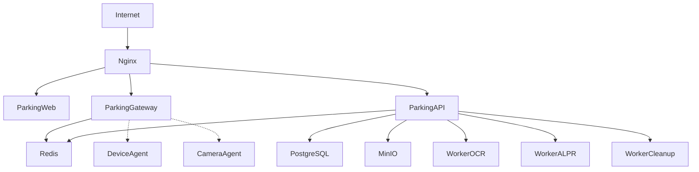
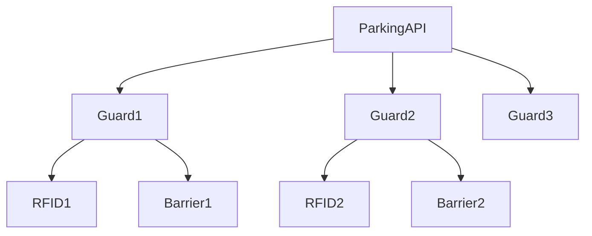
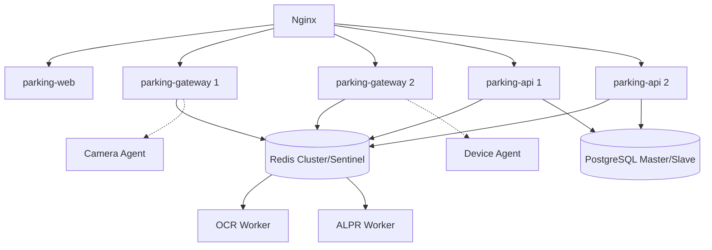

# docs/DEPLOYMENT.md

# Triển khai hệ thống Parking System

## 1. Mục tiêu

Tài liệu này mô tả cách triển khai toàn bộ hệ thống bằng Docker Compose.

Hệ thống được thiết kế theo kiến trúc Microservice:



---

# 2. Yêu cầu hệ thống

## MVP

### CPU

```text
4 Core
```

### RAM

```text
8 GB
```

### Disk

```text
100 GB SSD
```

---

## Production

### CPU

```text
8~16 Core
```

### RAM

```text
16~32 GB
```

### Disk

```text
500GB SSD
```

---

## Nếu dùng AI

### GPU

Khuyến nghị:

```text
RTX 3050 6GB

RTX 3060 12GB

RTX 4060 8GB

RTX A2000
```

---

# 3. Cấu trúc thư mục triển khai

```text
parking-system/

├── docker-compose.yml

├── .env

│

├── deploy/

│

├── nginx/

│   ├── nginx.conf

│   └── sites/

│

├── postgres/

│   └── data/

│

├── redis/

│

├── minio/

│   └── data/

│

├── backup/

│

├── logs/

│

└── monitoring/

    ├── prometheus/

    └── grafana/
```

---

# 4. File .env

```env
APP_ENV=production

POSTGRES_DB=parking

POSTGRES_USER=parking

POSTGRES_PASSWORD=parking

REDIS_PASSWORD=redis

MINIO_ROOT_USER=minioadmin

MINIO_ROOT_PASSWORD=minioadmin

JWT_SECRET=CHANGE_ME

TZ=Asia/Ho_Chi_Minh
```

---

# 5. Docker Compose

## docker-compose.yml

```yaml
services:

  parking-web:
    build:
      context: ./apps/parking-web
    restart: unless-stopped
    environment:
      VITE_API_URL: http://parking-api:8000
      VITE_WS_URL: ws://parking-gateway:8300

  parking-gateway:
    build:
      context: ./apps/parking-gateway
    restart: unless-stopped
    env_file:
      - .env
    ports:
      - "8300:8300"
    depends_on:
      - redis

  parking-api:
    build:
      context: ./apps/parking-api
    restart: unless-stopped
    env_file:
      - .env
    depends_on:
      - postgres
      - redis
      - minio

  postgres:

    image: postgres:17

    restart: unless-stopped

    environment:

      POSTGRES_DB: ${POSTGRES_DB}

      POSTGRES_USER: ${POSTGRES_USER}

      POSTGRES_PASSWORD: ${POSTGRES_PASSWORD}

    volumes:

      - ./deploy/postgres/data:/var/lib/postgresql/data

  redis:

    image: redis:8

    restart: unless-stopped

  minio:

    image: minio/minio

    command: server /data --console-address ":9001"

    environment:

      MINIO_ROOT_USER: ${MINIO_ROOT_USER}

      MINIO_ROOT_PASSWORD: ${MINIO_ROOT_PASSWORD}

    volumes:

      - ./deploy/minio/data:/data

  worker-ocr:

    build:

      context: ./apps/parking-worker

    command:

      celery -A app.celery_app worker -Q ocr

  worker-alpr:

    build:

      context: ./apps/parking-worker

    command:

      celery -A app.celery_app worker -Q alpr

  worker-cleanup:

    build:

      context: ./apps/parking-worker

    command:

      celery -A app.celery_app worker -Q cleanup

  nginx:

    image: nginx:alpine

    ports:

      - "80:80"

      - "443:443"

    volumes:

      - ./deploy/nginx/nginx.conf:/etc/nginx/nginx.conf

      - ./deploy/nginx/sites:/etc/nginx/conf.d

```

---

# 6. Build hệ thống

## Build toàn bộ

```bash
docker compose build
```

---

## Build từng service

```bash
docker compose build parking-api
```

```bash
docker compose build parking-web
```

```bash
docker compose build worker-alpr
```

---

# 7. Khởi động

```bash
docker compose up -d
```

---

Kiểm tra:

```bash
docker compose ps
```

---

Xem log:

```bash
docker compose logs -f
```

---

Xem log service:

```bash
docker compose logs -f parking-api
```

---

# 8. Cập nhật

Pull source:

```bash
git pull
```

---

Build lại:

```bash
docker compose build
```

---

Restart:

```bash
docker compose up -d
```

---

# 9. Nginx Reverse Proxy

## parking.conf

```nginx
server {
    listen 80;
    server_name parking.example.com;

    location / {
        proxy_pass http://parking-web:3000;
    }

    location /api {
        proxy_pass http://parking-api:8000;
    }

    location /ws {
        proxy_pass http://parking-gateway:8300;

        proxy_set_header Upgrade $http_upgrade;
        proxy_set_header Connection "upgrade";
        proxy_set_header Host $host;
        proxy_set_header X-Real-IP $remote_addr;
        proxy_set_header X-Forwarded-For $proxy_add_x_forwarded_for;
    }
}
```

---

# 10. HTTPS

Khuyến nghị:

```text
Let's Encrypt
```

---

Ví dụ:

```bash
certbot certonly

--nginx

-d parking.example.com
```

---

# 11. GPU cho ALPR

Nếu server có GPU NVIDIA.

---

## Kiểm tra

```bash
nvidia-smi
```

---

## Docker

```bash
docker run --rm \

--gpus all \

nvidia/cuda:12.6.2-runtime-ubuntu22.04

nvidia-smi
```

---

## Compose

```yaml

worker-alpr:

  deploy:

    resources:

      reservations:

        devices:

        - driver: nvidia

          count: 1

          capabilities:

          - gpu

```

---

# 12. Device Agent từ xa

Có thể chạy:

```text
Server trung tâm

↓

parking-api

Guard PC 1

↓

device-agent

Guard PC 2

↓

device-agent
```

---

Sơ đồ:



---

# 13. Camera Agent từ xa

Có thể đặt:

### Cách 1

Camera Agent trên server.

```text
RTSP

↓

Camera Agent

↓

Parking API
```

---

### Cách 2

Camera Agent gần camera.

```text
Camera

↓

Mini PC

↓

Camera Agent

↓

Parking API
```

---

# 14. MinIO

## Bucket

Tạo:

```text
parking-media
```

---

## Cấu trúc

```text
parking-media/

├── snapshots/

│

├── entry/

│

├── exit/

│

├── videos/

│

├── thumbnails/

│

└── face/
```

---

# 15. Backup PostgreSQL

Backup:

```bash
docker exec postgres

pg_dump

-U parking

parking

> backup.sql
```

---

Restore:

```bash
cat backup.sql |

docker exec -i postgres

psql

-U parking

parking
```

---

# 16. Backup MinIO

Sử dụng:

```text
mc mirror
```

---

Ví dụ:

```bash
mc mirror \

parking/parking-media \

backup/parking-media
```

---

# 17. Monitoring

## Prometheus

Thu thập:

* CPU
* RAM
* Disk
* FPS Camera
* Queue Size
* Device Status

---

## Grafana

Dashboard:

```text
Parking Dashboard

System Dashboard

Camera Dashboard

Worker Dashboard
```

---

# 18. Health Check

API:

```text
GET /health

GET /health/full
```

---

Device:

```text
GET /health
```

---

Camera:

```text
GET /health
```

---

Worker:

```text
Celery Inspect
```

---

# 19. Logging

Khuyến nghị:

```text
JSON Logging
```

---

Stack:

```text
Parking Services

↓

Promtail

↓

Loki

↓

Grafana
```

---

Ví dụ log:

```json
{

"timestamp":"2026-06-17T09:30:00",

"service":"parking-api",

"level":"INFO",

"message":"Vehicle checked in",

"session_id":"xxx"

}
```

---

# 20. Scale hệ thống

## Single Server

```text
1 Server

↓

All Services
```

Phù hợp:

```text
1~3 cổng

< 5000 lượt/ngày
```

---

## Multi Server



Phù hợp:

```text
10+

cổng

Nhiều bãi xe

20.000+

lượt/ngày
```

---

# 21. Môi trường phát triển

Khởi động:

```bash
docker compose up
```

---

Chế độ mock:

```env
MOCK_RFID=true

MOCK_CAMERA=true

MOCK_OCR=true

MOCK_ALPR=true
```

---

Tự sinh:

* UID thẻ
* Ảnh xe
* Biển số
* Event camera
* Event barrier

---

# 22. CI/CD

Có thể dùng:

```text
GitHub Actions

GitLab CI

Jenkins
```

---

Pipeline:

```mermaid
graph TD

Git Push

↓

Unit Test

↓

Build Docker

↓

Push Registry

↓

Deploy

↓

Health Check

↓

Success
```

---

# 23. Roadmap triển khai

## MVP

```text
Parking Web

Parking API

PostgreSQL

Redis

MinIO

Device Agent

Camera Agent

OCR Worker
```

---

## Version 1

```text
ALPR Worker

Barrier

Prometheus

Grafana

Backup
```

---

## Version 2

```text
Multi Site

Face Recognition

GPU Cluster

Kubernetes

HA PostgreSQL
```

---

# 24. Tổng kết

Toàn bộ hệ thống được thiết kế theo triết lý:

* Mỗi service một nhiệm vụ.
* Giao tiếp bằng API hoặc Queue.
* Có thể chạy độc lập.
* Có thể scale riêng.
* Có thể triển khai từ:

```text
1 server mini

↓

đến

↓

hệ thống nhiều bãi xe

↓

hàng chục nghìn lượt gửi xe mỗi ngày.
```
