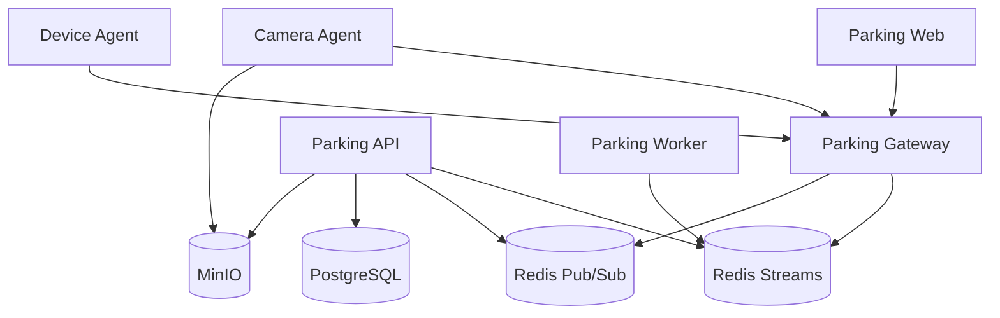
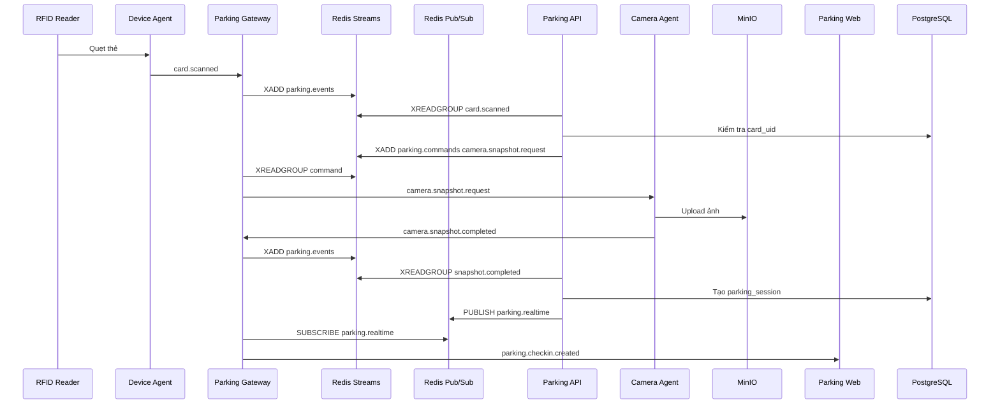
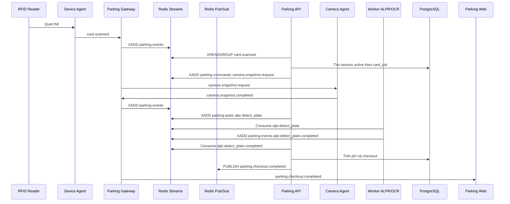
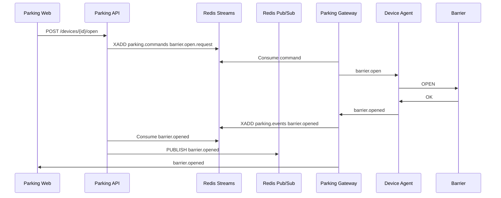
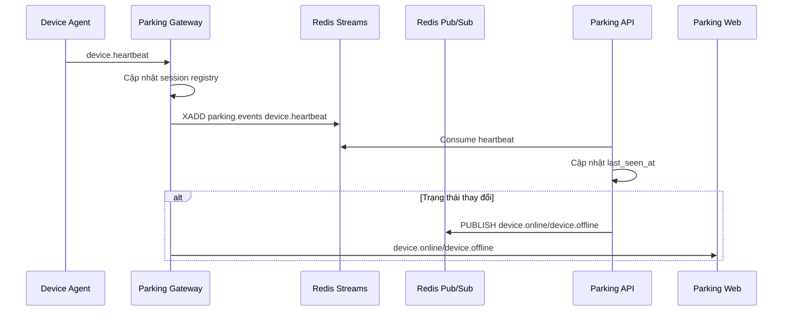

# docs/EVENTS_AND_FLOWS.md

# Events and Flows

## 1. Mục tiêu

Tài liệu này định nghĩa chuẩn event, command và luồng xử lý chính của hệ thống Parking System.

Hệ thống sử dụng mô hình event-driven, nhưng không dùng một cơ chế duy nhất cho tất cả event.

Thiết kế chuẩn:

```text
Business Event  → Redis Streams
Realtime Event  → Redis Pub/Sub
Command         → Redis Streams
Background Task → Redis Streams / Celery Queue
```

---

# 2. Thành phần liên quan



---

# 3. Nguyên tắc thiết kế

## 3.1. Gateway không xử lý nghiệp vụ

`parking-gateway` chỉ xử lý:

* WebSocket
* Agent connection
* Heartbeat
* Event routing
* Command routing
* Realtime broadcast

Gateway không tạo parking session, không tính phí, không xử lý thanh toán.

---

## 3.2. API xử lý nghiệp vụ

`parking-api` xử lý:

* Kiểm tra thẻ
* Tạo lượt gửi xe
* Checkout
* Tính phí
* Lưu database
* Gửi command đến agent
* Publish realtime event

---

## 3.3. Agent không gọi trực tiếp API

Agent chỉ kết nối đến Gateway:

```text
device-agent  -> parking-gateway
camera-agent  -> parking-gateway
parking-web   -> parking-gateway
```

---

# 4. Redis Streams và Redis Pub/Sub

## 4.1. Redis Streams

Dùng cho event quan trọng, không được mất dữ liệu.

Streams chính:

```text
parking.events
parking.commands
parking.tasks
parking.dead_letters
```

Dùng cho:

```text
card.scanned
camera.snapshot.completed
ocr.detect_plate.completed
barrier.opened
barrier.closed
```

Ưu điểm:

* Có message ID
* Có consumer group
* Có ACK
* Có retry
* Có replay
* Có pending list

---

## 4.2. Redis Pub/Sub

Dùng cho realtime event nhẹ, có thể bỏ qua nếu client mất kết nối.

Channels chính:

```text
parking.realtime
parking.notifications
```

Dùng cho:

```text
parking.checkin.created
parking.checkout.completed
device.online
device.offline
camera.online
camera.offline
parking.warning.created
```

Ưu điểm:

* Nhanh
* Nhẹ
* Phù hợp realtime UI

---

# 5. Quy tắc chọn Streams hay Pub/Sub

## Dùng Redis Streams nếu:

* Event liên quan đến nghiệp vụ
* Event không được mất
* Event cần retry
* Event cần audit
* Event cần replay
* Event làm thay đổi database

Ví dụ:

```text
card.scanned
camera.snapshot.completed
payment.created
barrier.opened
ocr.detect_plate.completed
```

## Dùng Redis Pub/Sub nếu:

* Event chỉ để cập nhật UI realtime
* Client mất kết nối thì có thể bỏ qua
* Có thể reload lại dữ liệu từ API
* Không cần retry

Ví dụ:

```text
parking.checkin.created
dashboard.updated
device.online
camera.offline
notification.created
```

---

# 6. Event format chuẩn

Tất cả event quan trọng nên dùng format chung.

```json
{
  "event_id": "b0b8635d-5ff1-4b4a-8768-2d1d3f8ef9d3",
  "event_type": "card.scanned",
  "source": "device-agent",
  "source_id": "device-agent-gate-01",
  "site_id": "main-site",
  "zone_id": "zone-b1",
  "gate_id": "gate-entry-01",
  "device_id": "rfid-entry-01",
  "camera_id": null,
  "session_id": null,
  "correlation_id": "c0c0d90e-23ef-4667-8b75-5ad67930f7d1",
  "payload": {
    "card_uid": "04A12345"
  },
  "created_at": "2026-06-17T09:30:00+07:00"
}
```

---

# 7. Ý nghĩa field

| Field          | Ý nghĩa                              |
| -------------- | ------------------------------------ |
| event_id       | ID duy nhất của event                |
| event_type     | Loại event                           |
| source         | Nguồn phát sinh event                |
| source_id      | ID nguồn phát sinh                   |
| site_id        | Bãi xe                               |
| zone_id        | Khu vực                              |
| gate_id        | Cổng                                 |
| device_id      | Thiết bị                             |
| camera_id      | Camera                               |
| session_id     | Parking session                      |
| correlation_id | ID gom nhóm các event cùng một luồng |
| payload        | Dữ liệu chi tiết                     |
| created_at     | Thời điểm tạo event                  |

---

# 8. Correlation ID

`correlation_id` dùng để gom các event thuộc cùng một giao dịch.

Ví dụ một lượt check-in:

```text
card.scanned
camera.snapshot.request
camera.snapshot.completed
parking.checkin.created
```

Tất cả event trên nên có cùng `correlation_id`.

---

# 9. Danh sách event chính

## 9.1. Device events

```text
device.online
device.offline
device.heartbeat
device.error
card.scanned
barrier.opened
barrier.closed
barrier.error
```

## 9.2. Camera events

```text
camera.online
camera.offline
camera.heartbeat
camera.error
camera.snapshot.requested
camera.snapshot.completed
camera.motion.detected
camera.record.started
camera.record.stopped
```

## 9.3. Parking events

```text
parking.checkin.requested
parking.checkin.created
parking.checkout.requested
parking.checkout.completed
parking.session.cancelled
parking.warning.created
parking.payment.completed
```

## 9.4. Worker events

```text
ocr.detect_plate.requested
ocr.detect_plate.completed
ocr.detect_plate.failed
alpr.detect_plate.requested
alpr.detect_plate.completed
alpr.detect_plate.failed
media.thumbnail.created
media.cleanup.completed
```

---

# 10. Command format chuẩn

Command được ghi vào Redis Streams `parking.commands`.

```json
{
  "command_id": "93ec9207-a47f-44f5-91e7-29b02c95e2d0",
  "command_type": "camera.snapshot.request",
  "target_agent_id": "camera-agent-gate-01",
  "target_device_id": null,
  "target_camera_id": "cam-entry-01",
  "site_id": "main-site",
  "gate_id": "gate-entry-01",
  "correlation_id": "c0c0d90e-23ef-4667-8b75-5ad67930f7d1",
  "payload": {
    "snapshot_type": "entry_overview",
    "upload_to_minio": true
  },
  "created_at": "2026-06-17T09:30:01+07:00",
  "timeout_seconds": 5
}
```

---

# 11. Luồng check-in



---

# 12. Luồng check-out



---

# 13. Luồng mở barrier



---

# 14. Luồng heartbeat

Heartbeat là event trạng thái thiết bị.

Gateway nhận heartbeat từ Agent.

API có thể consume heartbeat để cập nhật database, nhưng Web không cần nhận toàn bộ heartbeat.



---

# 15. Event card.scanned

```json
{
  "event_id": "uuid",
  "event_type": "card.scanned",
  "source": "device-agent",
  "source_id": "device-agent-gate-01",
  "site_id": "main-site",
  "gate_id": "gate-entry-01",
  "device_id": "rfid-entry-01",
  "correlation_id": "uuid",
  "payload": {
    "card_uid": "04A12345",
    "raw": "04A12345"
  },
  "created_at": "2026-06-17T09:30:00+07:00"
}
```

---

# 16. Command camera.snapshot.request

```json
{
  "command_id": "uuid",
  "command_type": "camera.snapshot.request",
  "target_agent_id": "camera-agent-gate-01",
  "target_camera_id": "cam-entry-overview",
  "site_id": "main-site",
  "gate_id": "gate-entry-01",
  "correlation_id": "uuid",
  "payload": {
    "snapshot_type": "entry_overview",
    "quality": 90
  },
  "created_at": "2026-06-17T09:30:01+07:00",
  "timeout_seconds": 5
}
```

---

# 17. Event camera.snapshot.completed

```json
{
  "event_id": "uuid",
  "event_type": "camera.snapshot.completed",
  "source": "camera-agent",
  "source_id": "camera-agent-gate-01",
  "site_id": "main-site",
  "gate_id": "gate-entry-01",
  "camera_id": "cam-entry-overview",
  "correlation_id": "uuid",
  "payload": {
    "media_id": "media-uuid",
    "bucket": "parking-media",
    "object_key": "main-site/2026/06/17/session-id/entry_overview.jpg",
    "width": 1920,
    "height": 1080,
    "mime_type": "image/jpeg"
  },
  "created_at": "2026-06-17T09:30:02+07:00"
}
```

---

# 18. Realtime event parking.checkin.created

Realtime event được publish qua Redis Pub/Sub `parking.realtime`.

```json
{
  "event_type": "parking.checkin.created",
  "source": "parking-api",
  "session_id": "session-uuid",
  "site_id": "main-site",
  "gate_id": "gate-entry-01",
  "correlation_id": "uuid",
  "payload": {
    "session_code": "PK202606170001",
    "card_uid": "04A12345",
    "entry_time": "2026-06-17T09:30:00+07:00",
    "entry_plate_number": "51A12345",
    "entry_overview_image_id": "media-uuid",
    "status": "active"
  }
}
```

---

# 19. Idempotency

Một event trong Redis Streams có thể bị xử lý lại.

Vì vậy `parking-api` phải xử lý idempotent.

Nguyên tắc:

* `event_id` là duy nhất.
* API lưu event đã xử lý.
* Nếu nhận lại cùng `event_id`, bỏ qua hoặc trả kết quả cũ.
* Command cũng nên có `command_id` duy nhất.

Bảng đề xuất:

```sql
CREATE TABLE processed_events (
    id UUID PRIMARY KEY,
    event_id UUID NOT NULL UNIQUE,
    event_type VARCHAR(100) NOT NULL,
    processed_at TIMESTAMPTZ DEFAULT now(),
    status VARCHAR(50) NOT NULL,
    error_message TEXT
);
```

---

# 20. Retry

## 20.1. Retry command

Nếu command gửi đến Agent thất bại:

```text
Lần 1: ngay lập tức
Lần 2: sau 3 giây
Lần 3: sau 10 giây
Lần 4: sau 30 giây
```

Sau số lần retry tối đa, Gateway tạo event:

```text
command.failed
```

vào stream:

```text
parking.events
```

---

## 20.2. Retry event processing

Nếu API xử lý event lỗi:

* Không ACK message.
* Message nằm trong pending list của consumer group.
* API instance khác có thể claim lại.

---

# 21. Dead Letter Stream

Các event lỗi nhiều lần nên đưa vào:

```text
parking.dead_letters
```

Payload:

```json
{
  "original_stream": "parking.events",
  "event_id": "uuid",
  "event_type": "card.scanned",
  "error_message": "Card not found",
  "retry_count": 5,
  "failed_at": "2026-06-17T09:30:00+07:00"
}
```

---

# 22. Realtime event cho Web

Web chỉ nhận event đã xử lý hoặc event trạng thái tổng hợp.

Nên nhận:

```text
parking.checkin.created
parking.checkout.completed
parking.warning.created
device.online
device.offline
camera.online
camera.offline
barrier.opened
barrier.closed
notification.created
```

Không nên nhận trực tiếp:

```text
device.heartbeat
camera.heartbeat
raw.frame.received
```

---

# 23. Quy ước đặt tên event

Dùng format:

```text
domain.action.status
```

Ví dụ:

```text
parking.checkin.created
parking.checkout.completed
camera.snapshot.completed
device.heartbeat.received
barrier.opened
```

Command dùng format:

```text
domain.action.request
```

Ví dụ:

```text
camera.snapshot.request
barrier.open.request
device.restart.request
```

---

# 24. Tổng kết

Thiết kế event mới chia rõ:

```text
Redis Streams:
- parking.events
- parking.commands
- parking.tasks
- parking.dead_letters

Redis Pub/Sub:
- parking.realtime
- parking.notifications
```

Nguyên tắc:

* Event nghiệp vụ quan trọng dùng Redis Streams.
* Event realtime UI dùng Redis Pub/Sub.
* Agent chỉ kết nối Gateway.
* Gateway chỉ route event và command.
* API xử lý business logic.
* Worker xử lý AI/background task.
* Mọi business event có `event_id`.
* Mọi giao dịch có `correlation_id`.
* API xử lý idempotent.
* Event lỗi nhiều lần đưa vào `parking.dead_letters`.
