# Parking System Documentation

Đây là trang điều hướng chính cho toàn bộ tài liệu của dự án **Parking System**.

Mục tiêu của tài liệu là giúp người đọc hiểu:

* Dự án dùng để làm gì
* Kiến trúc hệ thống như thế nào
* Các service đảm nhận nhiệm vụ gì
* Luồng dữ liệu check-in / check-out hoạt động ra sao
* Cách cấu hình và triển khai bằng Docker
* Cách mở rộng bằng plugin
* Cách bảo mật hệ thống
* Cách đóng góp vào dự án

---

# 1. Graph View

> Nếu trình xem Markdown hỗ trợ Mermaid `click`, có thể bấm trực tiếp vào từng node để mở tài liệu tương ứng.
> Nếu không hỗ trợ click trên sơ đồ, dùng bảng điều hướng ở phần bên dưới.

```mermaid
flowchart TD
    ROOT["Parking System Docs"]

    README["README.md<br/>Tổng quan dự án"]
    ARCH["ARCHITECTURE.md<br/>Kiến trúc hệ thống"]
    DB["DATABASE.md<br/>Thiết kế database"]
    EVENTS["EVENTS_AND_FLOWS.md<br/>Event & luồng xử lý"]
    CONFIG["CONFIGURATION.md<br/>Cấu hình hệ thống"]
    APIREF["API_REFERENCE.md<br/>REST API Reference"]
    PLUGIN["PLUGIN_SYSTEM.md<br/>Plugin System"]
    SECURITY["SECURITY.md<br/>Bảo mật"]
    DEPLOY["DEPLOYMENT.md<br/>Triển khai"]
    CONTRIB["CONTRIBUTING.md<br/>Đóng góp dự án"]
    OBSERVABILITY["OBSERVABILITY.md<br/>Giám sát & Vận hành"]
    TESTING["TESTING.md<br/>Chiến lược Kiểm thử"]
    DR["DISASTER_RECOVERY.md<br/>Khôi phục thảm họa"]
    LOCAL_DEV["LOCAL_DEV.md<br/>Hướng dẫn Dev cục bộ"]
    AIGUIDE[".agents/codex.md<br/>Hướng dẫn cho AI Codex"]

    COMPOSE["docker-compose.yml<br/>Chạy toàn bộ service"]
    ENV[".env.example<br/>Mẫu biến môi trường"]

    SERVICES["Service Documents<br/>Chi tiết từng service"]

    S_API["services/api.md<br/>Parking API"]
    S_WEB["services/web.md<br/>Parking Web"]
    S_GATEWAY["services/gateway.md<br/>Parking Gateway"]
    S_DEVICE["services/device-agent.md<br/>Device Agent"]
    S_CAMERA["services/camera-agent.md<br/>Camera Agent"]
    S_WORKER["services/worker.md<br/>Worker"]

    ROOT --> README
    ROOT --> ARCH
    ROOT --> DB
    ROOT --> EVENTS
    ROOT --> CONFIG
    ROOT --> APIREF
    ROOT --> PLUGIN
    ROOT --> SECURITY
    ROOT --> DEPLOY
    ROOT --> CONTRIB
    ROOT --> OBSERVABILITY
    ROOT --> TESTING
    ROOT --> DR
    ROOT --> LOCAL_DEV
    ROOT --> AIGUIDE

    CONFIG --> ENV
    DEPLOY --> COMPOSE

    ARCH --> SERVICES
    SERVICES --> S_API
    SERVICES --> S_WEB
    SERVICES --> S_GATEWAY
    SERVICES --> S_DEVICE
    SERVICES --> S_CAMERA
    SERVICES --> S_WORKER

    EVENTS --> S_GATEWAY
    EVENTS --> S_API
    EVENTS --> S_DEVICE
    EVENTS --> S_CAMERA
    EVENTS --> S_WORKER

    PLUGIN --> S_DEVICE
    PLUGIN --> S_CAMERA
    PLUGIN --> S_WORKER

    APIREF --> S_API
    SECURITY --> S_GATEWAY
    SECURITY --> S_API

    click README "../README.md" "Mở README.md"
    click ARCH "./ARCHITECTURE.md" "Mở ARCHITECTURE.md"
    click DB "./DATABASE.md" "Mở DATABASE.md"
    click EVENTS "./EVENTS_AND_FLOWS.md" "Mở EVENTS_AND_FLOWS.md"
    click CONFIG "./CONFIGURATION.md" "Mở CONFIGURATION.md"
    click APIREF "./API_REFERENCE.md" "Mở API_REFERENCE.md"
    click PLUGIN "./PLUGIN_SYSTEM.md" "Mở PLUGIN_SYSTEM.md"
    click SECURITY "./SECURITY.md" "Mở SECURITY.md"
    click DEPLOY "./DEPLOYMENT.md" "Mở DEPLOYMENT.md"
    click CONTRIB "./CONTRIBUTING.md" "Mở CONTRIBUTING.md"
    click OBSERVABILITY "./OBSERVABILITY.md" "Mở OBSERVABILITY.md"
    click TESTING "./TESTING.md" "Mở TESTING.md"
    click DR "./DISASTER_RECOVERY.md" "Mở DISASTER_RECOVERY.md"
    click LOCAL_DEV "./LOCAL_DEV.md" "Mở LOCAL_DEV.md"
    click AIGUIDE "../.agents/codex.md" "Mở .agents/codex.md"

    click COMPOSE "../docker-compose.yml" "Mở docker-compose.yml"
    click ENV "../.env.example" "Mở .env.example"

    click S_API "./services/api.md" "Mở services/api.md"
    click S_WEB "./services/web.md" "Mở services/web.md"
    click S_GATEWAY "./services/gateway.md" "Mở services/gateway.md"
    click S_DEVICE "./services/device-agent.md" "Mở services/device-agent.md"
    click S_CAMERA "./services/camera-agent.md" "Mở services/camera-agent.md"
    click S_WORKER "./services/worker.md" "Mở services/worker.md"
```



---

# 2. Tài liệu chính

## 2.1. README.md

Đường dẫn:

[../README.md](../README.md)

Chức năng:

* Giới thiệu tổng quan dự án
* Mô tả mục tiêu hệ thống
* Liệt kê tính năng chính
* Hướng dẫn chạy nhanh
* Giới thiệu các service chính
* Đưa người đọc đến các tài liệu chi tiết hơn

Nên đọc khi:

* Mới bắt đầu tìm hiểu dự án
* Muốn biết dự án giải quyết bài toán gì
* Muốn chạy thử nhanh bằng Docker

---

## 2.2. ARCHITECTURE.md

Đường dẫn:

[ARCHITECTURE.md](./ARCHITECTURE.md)

Chức năng:

* Mô tả kiến trúc tổng thể
* Giải thích vai trò của từng service
* Mô tả cách các service giao tiếp với nhau
* Phân biệt trách nhiệm giữa API, Gateway, Agent và Worker
* Giúp tránh thiết kế sai khi bắt đầu code

Nên đọc khi:

* Muốn hiểu toàn bộ hệ thống
* Chuẩn bị code một service mới
* Muốn biết dữ liệu đi từ đâu đến đâu
* Cần quyết định service nào xử lý logic nào

---

## 2.3. DATABASE.md

Đường dẫn:

[DATABASE.md](./DATABASE.md)

Chức năng:

* Mô tả thiết kế cơ sở dữ liệu
* Liệt kê các bảng chính
* Mô tả quan hệ giữa người dùng, xe, thẻ, bãi xe, camera, thiết bị và lượt gửi xe
* Định nghĩa cách lưu media metadata
* Đưa ra index, retention và partition đề xuất

Nên đọc khi:

* Chuẩn bị viết migration
* Thiết kế ORM model
* Viết API liên quan đến parking session
* Cần hiểu dữ liệu nghiệp vụ cốt lõi

---

## 2.4. EVENTS_AND_FLOWS.md

Đường dẫn:

[EVENTS_AND_FLOWS.md](./EVENTS_AND_FLOWS.md)

Chức năng:

* Chuẩn hóa event format
* Chuẩn hóa command format
* Mô tả Redis Streams và Redis Pub/Sub
* Mô tả luồng check-in
* Mô tả luồng check-out
* Mô tả luồng mở barrier
* Mô tả heartbeat của device/camera agent
* Định nghĩa `event_id`, `correlation_id`, retry, dead letter

Nên đọc khi:

* Viết `parking-gateway`
* Viết `parking-api` consumer
* Viết `device-agent`
* Viết `camera-agent`
* Viết worker OCR/ALPR
* Debug lỗi event hoặc luồng xử lý

---

## 2.5. CONFIGURATION.md

Đường dẫn:

[CONFIGURATION.md](./CONFIGURATION.md)

Chức năng:

* Mô tả toàn bộ biến môi trường
* Mô tả `.env.example`
* Mô tả cấu hình YAML cho device agent
* Mô tả cấu hình YAML cho camera agent
* Phân biệt Redis Streams và Redis Pub/Sub
* Mô tả cấu hình PostgreSQL, Redis, MinIO, JWT, Agent Token, Worker, Camera, Mock mode

Nên đọc khi:

* Cấu hình hệ thống lần đầu
* Cài đặt môi trường development
* Chuẩn bị triển khai production
* Gắn thiết bị thật vào hệ thống
* Sửa lỗi sai biến môi trường

---

## 2.6. API_REFERENCE.md

Đường dẫn:

[API_REFERENCE.md](./API_REFERENCE.md)

Chức năng:

* Mô tả REST API
* Định nghĩa request/response format
* Liệt kê endpoint cho auth, users, owners, vehicles, cards, devices, cameras, parking sessions, payments, reports
* Mô tả permission cần thiết cho từng nhóm API
* Mô tả error code chuẩn
* Mô tả API nào sinh event nào

Nên đọc khi:

* Viết frontend
* Viết mobile app
* Viết integration ngoài
* Test API bằng Postman/curl
* Viết backend endpoint

---

## 2.7. PLUGIN_SYSTEM.md

Đường dẫn:

[PLUGIN_SYSTEM.md](./PLUGIN_SYSTEM.md)

Chức năng:

* Mô tả cơ chế plugin
* Định nghĩa plugin interface cho device, camera, worker
* Mô tả plugin RFID, TCP, Serial, Barrier, RTSP, ONVIF, OCR, ALPR
* Mô tả metadata `plugin.yaml`
* Đưa ra ví dụ code plugin
* Mô tả lifecycle, error handling và security của plugin

Nên đọc khi:

* Muốn thêm đầu đọc thẻ mới
* Muốn thêm camera mới
* Muốn thêm barrier/relay mới
* Muốn thay OCR/ALPR engine
* Muốn phát triển plugin cho cộng đồng

---

## 2.8. SECURITY.md

Đường dẫn:

[SECURITY.md](./SECURITY.md)

Chức năng:

* Mô tả authentication bằng JWT
* Mô tả agent token
* Mô tả RBAC và permission
* Mô tả audit log
* Mô tả bảo mật media và signed URL
* Mô tả bảo mật gateway, event, plugin, network, backup
* Đưa ra production security checklist

Nên đọc khi:

* Chuẩn bị chạy production
* Thiết kế phân quyền
* Tạo user/role
* Tạo agent token
* Cấu hình camera/barrier
* Kiểm tra bảo mật trước khi triển khai thật

---

## 2.9. DEPLOYMENT.md

Đường dẫn:

[DEPLOYMENT.md](./DEPLOYMENT.md)

Chức năng:

* Mô tả triển khai bằng Docker Compose
* Mô tả cấu trúc thư mục triển khai
* Mô tả Nginx reverse proxy
* Mô tả HTTPS
* Mô tả GPU cho worker ALPR
* Mô tả backup PostgreSQL và MinIO
* Mô tả monitoring
* Mô tả scale hệ thống

Nên đọc khi:

* Muốn deploy hệ thống lên server
* Muốn dùng Nginx/HTTPS
* Muốn bật GPU cho ALPR
* Muốn backup/restore dữ liệu
* Muốn scale nhiều cổng hoặc nhiều bãi xe

---

## 2.10. CONTRIBUTING.md

Đường dẫn:

[CONTRIBUTING.md](./CONTRIBUTING.md)

Chức năng:

* Hướng dẫn đóng góp source code
* Hướng dẫn tạo branch, commit, pull request
* Định nghĩa coding standard
* Định nghĩa plugin contribution
* Định nghĩa testing, documentation, issue template
* Đưa ra quy tắc không commit secret/dữ liệu thật

Nên đọc khi:

* Muốn đóng góp code
* Muốn viết plugin
* Muốn sửa tài liệu
* Muốn gửi bug report
* Muốn làm việc nhóm trên dự án

---

## 2.11. OBSERVABILITY.md

Đường dẫn:

[OBSERVABILITY.md](./OBSERVABILITY.md)

Chức năng:

* Hướng dẫn thiết lập Prometheus, Grafana
* Định nghĩa định dạng log tiêu chuẩn
* Hướng dẫn truy vết Request ID
* Thiết lập hệ thống Alerting (Telegram/Slack)
* Kiểm tra Health Checks

Nên đọc khi:

* Cần giám sát trạng thái hệ thống
* Tìm nguyên nhân lỗi trên Production
* Xây dựng Dashboard theo dõi

---

## 2.12. TESTING.md

Đường dẫn:

[TESTING.md](./TESTING.md)

Chức năng:

* Quy định chiến lược viết Unit Test, Integration Test, E2E Test
* Hướng dẫn mock database và thiết bị ngoại vi
* Tích hợp CI/CD Pipeline

Nên đọc khi:

* Viết code mới và cần test
* Setup môi trường tự động kiểm thử

---

## 2.13. DISASTER_RECOVERY.md

Đường dẫn:

[DISASTER_RECOVERY.md](./DISASTER_RECOVERY.md)

Chức năng:

* Hướng dẫn chiến lược sao lưu dữ liệu (Postgres, Redis)
* Các kịch bản khôi phục khi server bị hỏng
* Hướng dẫn xử lý khi mất đồng bộ dữ liệu (Offline Queue)

Nên đọc khi:

* Xây dựng kịch bản an toàn dữ liệu
* Thực tập khôi phục hệ thống
* Cứu hộ hệ thống lúc gặp sự cố

---

## 2.14. LOCAL_DEV.md

Đường dẫn:

[LOCAL_DEV.md](./LOCAL_DEV.md)

Chức năng:

* Hướng dẫn cấu hình môi trường phát triển nhanh chóng
* Các bước khởi tạo DB, cài dependencies
* Cách chạy giả lập các thiết bị ngoại vi (Device Agent Mock)
* Bảng xử lý các lỗi thường gặp lúc cài cắm

Nên đọc khi:

* Mới tham gia vào dự án
* Muốn chạy thử code ở môi trường localhost nhanh nhất

---

## 2.15. .agents/codex.md

Đường dẫn:

[../.agents/codex.md](../.agents/codex.md)

Chức năng:

* Hướng dẫn các quy tắc cốt lõi cho trợ lý AI (Codex, Antigravity)
* Ngăn chặn AI viết code phá vỡ kiến trúc
* Ép AI đọc và cập nhật các tài liệu Markdown khi sửa code

Nên đọc khi:

* Cần copy nội dung để prompt cho công cụ AI mới
* Nhắc AI tuân thủ luật lệ của project

---

# 3. File chạy hệ thống

## 3.1. docker-compose.yml

Đường dẫn:

[../docker-compose.yml](../docker-compose.yml)

Chức năng:

* Khai báo toàn bộ container
* Chạy PostgreSQL, Redis, MinIO
* Chạy parking-web
* Chạy parking-api
* Chạy parking-gateway
* Chạy device-agent
* Chạy camera-agent
* Chạy worker OCR/ALPR/media/cleanup
* Hỗ trợ profile proxy và GPU

Dùng khi:

```bash
docker compose build
docker compose up -d
```

---

## 3.2. .env.example

Đường dẫn:

[../.env.example](../.env.example)

Chức năng:

* File mẫu cấu hình môi trường
* Copy thành `.env` trước khi chạy
* Chứa biến cấu hình database, Redis, MinIO, JWT, Gateway, Worker, Agent, Camera, Mock mode

Dùng khi:

```bash
cp .env.example .env
```

---

# 4. Tài liệu chi tiết từng service

Các tài liệu trong `docs/services/` là phụ lục kỹ thuật cho từng service.

Chúng không thay thế tài liệu chính, nhưng giúp developer hiểu rõ trách nhiệm nội bộ của từng service.

---

## 4.1. Parking API

Đường dẫn:

[services/api.md](./services/api.md)

Chức năng:

* Mô tả service xử lý nghiệp vụ chính
* Mô tả cấu trúc thư mục FastAPI
* Mô tả auth, users, vehicles, cards, parking sessions, cameras, devices
* Mô tả cách API consume event và publish command/realtime event

Đọc khi:

* Code backend API
* Viết service layer
* Viết repository
* Viết migration
* Xử lý check-in/check-out

---

## 4.2. Parking Web

Đường dẫn:

[services/web.md](./services/web.md)

Chức năng:

* Mô tả frontend Vue 3
* Mô tả layout dashboard
* Mô tả màn hình check-in
* Mô tả màn hình check-out
* Mô tả quản lý camera, device, vehicle, card
* Mô tả state management và WebSocket

Đọc khi:

* Code frontend
* Thiết kế UI/UX
* Làm dashboard realtime
* Làm màn hình bảo vệ sử dụng hằng ngày

---

## 4.3. Parking Gateway

Đường dẫn:

[services/gateway.md](./services/gateway.md)

Chức năng:

* Mô tả service realtime/event routing
* Quản lý WebSocket từ Web
* Quản lý kết nối Device Agent
* Quản lý kết nối Camera Agent
* Quản lý heartbeat
* Định tuyến command
* Kết nối Redis Streams và Redis Pub/Sub

Đọc khi:

* Code gateway
* Debug WebSocket
* Debug agent online/offline
* Debug command không đến agent
* Scale nhiều gateway

---

## 4.4. Device Agent

Đường dẫn:

[services/device-agent.md](./services/device-agent.md)

Chức năng:

* Mô tả service đọc thiết bị vật lý
* Hỗ trợ RFID, barcode, barrier, relay
* Hỗ trợ USB, Serial, TCP, MQTT, mock
* Mô tả queue offline
* Mô tả plugin thiết bị

Đọc khi:

* Gắn đầu đọc RFID
* Gắn barrier
* Viết plugin Serial/TCP
* Chạy agent trên máy bảo vệ
* Xử lý mất mạng hoặc offline queue

---

## 4.5. Camera Agent

Đường dẫn:

[services/camera-agent.md](./services/camera-agent.md)

Chức năng:

* Mô tả service camera
* Hỗ trợ RTSP, USB, ONVIF, HTTP Snapshot
* Mô tả snapshot, stream, record, frame buffer
* Mô tả upload ảnh lên MinIO
* Mô tả phối hợp với parking session

Đọc khi:

* Gắn camera IP
* Chụp ảnh xe vào/ra
* Cấu hình RTSP
* Làm live preview
* Xử lý camera offline

---

## 4.6. Worker

Đường dẫn:

[services/worker.md](./services/worker.md)

Chức năng:

* Mô tả background worker
* Mô tả OCR biển số
* Mô tả ALPR
* Mô tả face recognition
* Mô tả media processing
* Mô tả cleanup dữ liệu cũ
* Mô tả GPU worker

Đọc khi:

* Viết OCR
* Viết ALPR
* Xử lý ảnh/video
* Tạo thumbnail
* Dọn media hết hạn
* Bật GPU cho AI

---

# 5. Thứ tự đọc tài liệu đề xuất

## 5.1. Người mới tìm hiểu dự án

```text
README.md
docs/README.md
docs/ARCHITECTURE.md
docs/DEPLOYMENT.md
```

---

## 5.2. Người muốn chạy thử bằng Docker

```text
README.md
docs/CONFIGURATION.md
docker-compose.yml
.env.example
docs/DEPLOYMENT.md
```

---

## 5.3. Backend developer

```text
docs/ARCHITECTURE.md
docs/DATABASE.md
docs/EVENTS_AND_FLOWS.md
docs/API_REFERENCE.md
docs/services/api.md
```

---

## 5.4. Frontend developer

```text
docs/API_REFERENCE.md
docs/EVENTS_AND_FLOWS.md
docs/services/web.md
```

---

## 5.5. Hardware / IoT developer

```text
docs/EVENTS_AND_FLOWS.md
docs/CONFIGURATION.md
docs/PLUGIN_SYSTEM.md
docs/services/device-agent.md
docs/services/camera-agent.md
```

---

## 5.6. AI / Computer Vision developer

```text
docs/PLUGIN_SYSTEM.md
docs/services/worker.md
docs/services/camera-agent.md
docs/EVENTS_AND_FLOWS.md
```

---

## 5.7. DevOps / System Admin

```text
docs/CONFIGURATION.md
docs/DEPLOYMENT.md
docs/SECURITY.md
docker-compose.yml
.env.example
```

---

# 6. Trách nhiệm của từng tài liệu

| Tài liệu              | Trách nhiệm chính                  |
| --------------------- | ---------------------------------- |
| `README.md`           | Giới thiệu dự án                   |
| `docs/README.md`      | Điều hướng toàn bộ tài liệu        |
| `ARCHITECTURE.md`     | Khóa kiến trúc hệ thống            |
| `DATABASE.md`         | Khóa thiết kế dữ liệu              |
| `EVENTS_AND_FLOWS.md` | Khóa event, command và luồng xử lý |
| `CONFIGURATION.md`    | Khóa cấu hình runtime              |
| `API_REFERENCE.md`    | Khóa REST API                      |
| `PLUGIN_SYSTEM.md`    | Khóa cơ chế mở rộng                |
| `SECURITY.md`         | Khóa nguyên tắc bảo mật            |
| `DEPLOYMENT.md`       | Hướng dẫn triển khai               |
| `CONTRIBUTING.md`     | Hướng dẫn đóng góp                 |
| `OBSERVABILITY.md`    | Hướng dẫn giám sát, log, alert     |
| `TESTING.md`          | Tiêu chuẩn và cách viết test       |
| `DISASTER_RECOVERY.md`| Kịch bản sao lưu và phục hồi       |
| `LOCAL_DEV.md`        | Cẩm nang cài đặt local nhanh       |
| `.agents/codex.md`    | Hướng dẫn dành cho Trợ lý AI       |
| `services/*.md`       | Chi tiết kỹ thuật từng service     |

---

# 7. Nguyên tắc cập nhật tài liệu

Khi thay đổi source code, cần cập nhật tài liệu tương ứng.

## 7.1. Thay đổi API

Cập nhật:

```text
docs/API_REFERENCE.md
docs/services/api.md
```

---

## 7.2. Thay đổi database

Cập nhật:

```text
docs/DATABASE.md
```

---

## 7.3. Thay đổi event hoặc command

Cập nhật:

```text
docs/EVENTS_AND_FLOWS.md
docs/services/gateway.md
```

---

## 7.4. Thay đổi cấu hình

Cập nhật:

```text
docs/CONFIGURATION.md
.env.example
docker-compose.yml
```

---

## 7.5. Thay đổi plugin

Cập nhật:

```text
docs/PLUGIN_SYSTEM.md
docs/services/device-agent.md
docs/services/camera-agent.md
docs/services/worker.md
```

---

## 7.6. Thay đổi triển khai

Cập nhật:

```text
docs/DEPLOYMENT.md
docker-compose.yml
```

---

# 8. Tổng kết

`docs/README.md` là bản đồ chính của toàn bộ tài liệu.

Nó giúp người đọc biết:

* Nên đọc file nào trước
* File nào dùng để làm gì
* Service nào liên quan đến tài liệu nào
* Khi thay đổi code thì phải cập nhật tài liệu nào
* Developer từng mảng nên đọc những tài liệu nào

Nếu dự án phát triển lớn hơn, file này nên luôn được cập nhật để tránh tình trạng tài liệu bị rời rạc hoặc trùng lặp.
