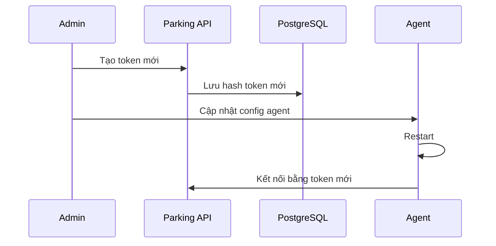

# docs/SECURITY.md

# Security

## 1. Giới thiệu

Tài liệu này mô tả thiết kế bảo mật cho hệ thống **Parking System**.

Hệ thống có nhiều thành phần nhạy cảm:

* Tài khoản người dùng
* Thẻ RFID
* Camera
* Ảnh xe vào/ra
* Barrier
* Lịch sử gửi xe
* Thanh toán
* Audit log
* Agent kết nối từ máy bảo vệ
* Plugin thiết bị

Vì vậy cần thiết kế bảo mật ngay từ đầu.

---

# 2. Nguyên tắc bảo mật

## 2.1. Không tin tưởng client

Các thành phần sau đều không được tin tưởng tuyệt đối:

```text
parking-web
device-agent
camera-agent
plugin
request từ browser
```

Toàn bộ nghiệp vụ quan trọng phải được kiểm tra lại ở:

```text
parking-api
```

---

## 2.2. API là nơi quyết định nghiệp vụ

`parking-api` chịu trách nhiệm:

* Kiểm tra quyền
* Kiểm tra thẻ
* Kiểm tra trạng thái lượt gửi xe
* Tính phí
* Cho phép hoặc từ chối mở barrier
* Ghi audit log

`parking-gateway` chỉ route event, không quyết định nghiệp vụ.

---

## 2.3. Mọi hành động quan trọng phải có audit log

Các thao tác sau bắt buộc ghi log:

```text
Đăng nhập
Đăng xuất
Tạo người dùng
Khóa người dùng
Tạo thẻ
Khóa thẻ
Mở khóa thẻ
Check-in thủ công
Check-out thủ công
Hủy lượt gửi xe
Đóng lượt gửi xe thủ công
Mở barrier thủ công
Sửa biển số
Xóa media
Thay đổi cấu hình camera
Thay đổi cấu hình thiết bị
Thay đổi phân quyền
```

---

# 3. Authentication

## 3.1. User Authentication

Người dùng đăng nhập qua:

```http
POST /api/v1/auth/login
```

Hệ thống trả về:

```text
access_token
refresh_token
```

---

## 3.2. Access Token

Access token dùng để gọi API.

Thời gian sống khuyến nghị:

```text
15 phút đến 1 giờ
```

Cấu hình:

```env
JWT_ACCESS_TOKEN_EXPIRE_SECONDS=3600
```

---

## 3.3. Refresh Token

Refresh token dùng để cấp access token mới.

Thời gian sống khuyến nghị:

```text
7 ngày
```

Cấu hình:

```env
JWT_REFRESH_TOKEN_EXPIRE_SECONDS=604800
```

---

## 3.4. JWT payload

Ví dụ:

```json
{
  "sub": "user-uuid",
  "username": "guard01",
  "role": "guard",
  "permissions": [
    "parking.checkin",
    "parking.checkout"
  ],
  "iat": 1781660000,
  "exp": 1781663600
}
```

---

# 4. Password Security

## 4.1. Hash password

Không lưu password dạng plain text.

Nên dùng:

```text
Argon2id
```

hoặc:

```text
bcrypt
```

Khuyến nghị:

```text
Argon2id
```

---

## 4.2. Chính sách mật khẩu

MVP có thể áp dụng:

```text
Tối thiểu 8 ký tự
Có chữ và số
Không trùng username
Không dùng password mặc định trên production
```

Production nên áp dụng thêm:

```text
Tối thiểu 12 ký tự
Có chữ hoa
Có chữ thường
Có số
Có ký tự đặc biệt
Hết hạn mật khẩu theo chính sách công ty
```

---

## 4.3. Tài khoản mặc định

Không để tài khoản mặc định trên production.

Ví dụ không an toàn:

```text
admin / admin
admin / 123456
```

Sau khi khởi tạo lần đầu, hệ thống phải yêu cầu đổi mật khẩu admin.

---

# 5. Authorization

## 5.1. Role-Based Access Control

Hệ thống dùng RBAC.

Role mặc định:

```text
admin
supervisor
guard
readonly
```

---

## 5.2. Admin

Toàn quyền hệ thống.

Có thể:

```text
Quản lý người dùng
Quản lý phân quyền
Quản lý bãi xe
Quản lý thiết bị
Quản lý camera
Xem báo cáo
Xem audit log
Thay đổi cấu hình hệ thống
```

---

## 5.3. Supervisor

Quản lý vận hành.

Có thể:

```text
Xem dashboard
Xem lịch sử
Hủy lượt gửi xe
Đóng lượt thủ công
Mở barrier thủ công
Xem báo cáo
Xem trạng thái thiết bị
```

Không nên được:

```text
Tạo admin
Sửa quyền hệ thống
Xóa audit log
Thay đổi secret
```

---

## 5.4. Guard

Nhân viên bảo vệ.

Có thể:

```text
Check-in
Check-out
Xem lịch sử gần đây
Chụp lại ảnh
Nhập biển số thủ công
```

Không nên được:

```text
Xóa lượt gửi xe
Xóa ảnh
Sửa phí
Sửa cấu hình thiết bị
Mở barrier ngoài quy trình nếu không được cấp quyền riêng
```

---

## 5.5. Readonly

Chỉ xem dữ liệu.

Có thể:

```text
Xem dashboard
Xem lịch sử
Xem báo cáo
```

Không được:

```text
Tạo dữ liệu
Sửa dữ liệu
Xóa dữ liệu
Điều khiển barrier
```

---

# 6. Permission List

Danh sách permission đề xuất:

```text
user.view
user.create
user.update
user.disable

role.view
role.update

owner.view
owner.create
owner.update
owner.delete

vehicle.view
vehicle.create
vehicle.update
vehicle.delete

card.view
card.create
card.update
card.block
card.unblock

parking.checkin
parking.checkout
parking.session.cancel
parking.session.manual_close
parking.plate.update

device.view
device.create
device.update
device.restart

barrier.open
barrier.close
barrier.manual_open

camera.view
camera.create
camera.update
camera.snapshot
camera.restart

media.view
media.upload
media.delete

report.view
report.export

settings.view
settings.update

audit_log.view
```

---

# 7. Permission Matrix

| Chức năng             | Admin | Supervisor |        Guard | Readonly |
| --------------------- | ----: | ---------: | -----------: | -------: |
| Dashboard             |    Có |         Có |           Có |       Có |
| Check-in              |    Có |         Có |           Có |    Không |
| Check-out             |    Có |         Có |           Có |    Không |
| Hủy lượt gửi xe       |    Có |         Có |        Không |    Không |
| Đóng lượt thủ công    |    Có |         Có |        Không |    Không |
| Mở barrier thủ công   |    Có |         Có | Tùy cấu hình |    Không |
| Quản lý thẻ           |    Có |         Có |        Không |    Không |
| Quản lý xe            |    Có |         Có |        Không |    Không |
| Quản lý camera        |    Có |      Không |        Không |    Không |
| Quản lý thiết bị      |    Có |      Không |        Không |    Không |
| Xem báo cáo           |    Có |         Có |        Không |       Có |
| Export báo cáo        |    Có |         Có |        Không |    Không |
| Xem audit log         |    Có |         Có |        Không |    Không |
| Sửa cấu hình hệ thống |    Có |      Không |        Không |    Không |

---

# 8. Agent Authentication

## 8.1. Vì sao Agent cần token riêng?

`device-agent` và `camera-agent` không phải người dùng.

Không nên dùng tài khoản user cho agent.

Agent phải dùng:

```text
agent_id
agent_token
```

---

## 8.2. Agent kết nối Gateway

WebSocket endpoint:

```text
ws://parking-gateway:8300/ws/device-agent
ws://parking-gateway:8300/ws/camera-agent
```

Header:

```http
X-Agent-ID: device-agent-gate-01
X-Agent-Token: xxxxx
```

---

## 8.3. Agent token

Agent token nên được tạo bởi admin.

Ví dụ:

```bash
openssl rand -hex 32
```

Không hardcode token vào source code.

Không commit token lên Git.

---

## 8.4. Agent token rotation

Production nên hỗ trợ xoay token.

Luồng:



---

# 9. Gateway Security

## 9.1. Gateway không được xử lý nghiệp vụ

Gateway chỉ:

```text
Verify token
Nhận event
Route event
Route command
Broadcast realtime
Theo dõi heartbeat
```

Gateway không được:

```text
Tạo parking session
Tính phí
Quyết định mở barrier
Ghi thanh toán
```

---

## 9.2. Rate limit

Gateway cần rate limit theo:

```text
IP
agent_id
user_id
event_type
```

Ví dụ:

```text
card.scanned: 20 event / giây / agent
device.heartbeat: 1 event / 30 giây / agent
camera.snapshot.completed: 10 event / giây / agent
```

---

## 9.3. Validate event

Gateway cần validate:

```text
event_type có hợp lệ không
agent_id có quyền gửi event này không
device_id có thuộc agent này không
camera_id có thuộc agent này không
payload có đúng schema không
```

---

# 10. Event Security

## 10.1. Business event phải có event_id

Mọi event quan trọng phải có:

```text
event_id
correlation_id
created_at
source
source_id
```

---

## 10.2. Chống replay event

Một agent độc hại hoặc lỗi mạng có thể gửi lại event cũ.

`parking-api` cần chống xử lý trùng bằng bảng:

```sql
CREATE TABLE processed_events (
    id UUID PRIMARY KEY,
    event_id UUID NOT NULL UNIQUE,
    event_type VARCHAR(100) NOT NULL,
    processed_at TIMESTAMPTZ DEFAULT now(),
    status VARCHAR(50) NOT NULL,
    error_message TEXT
);
```

---

## 10.3. Event timestamp

API nên từ chối event quá cũ.

Ví dụ:

```text
created_at cũ hơn 10 phút
```

Ngoại lệ:

```text
offline queue từ device-agent
```

Với offline queue, agent cần đánh dấu:

```json
{
  "payload": {
    "offline_replay": true,
    "original_created_at": "2026-06-17T09:30:00+07:00"
  }
}
```

---

# 11. API Security

## 11.1. HTTPS

Production bắt buộc dùng HTTPS.

Không chạy production qua HTTP public.

```text
http://localhost
```

chỉ dùng cho development.

Production:

```text
https://parking.example.com
wss://parking.example.com/ws/web
```

---

## 11.2. CORS

Chỉ cho phép domain tin cậy.

Ví dụ:

```env
CORS_ALLOWED_ORIGINS=https://parking.example.com
```

Không dùng:

```text
*
```

trên production.

---

## 11.3. Security headers

Nginx nên thêm:

```nginx
add_header X-Frame-Options "SAMEORIGIN";
add_header X-Content-Type-Options "nosniff";
add_header Referrer-Policy "strict-origin-when-cross-origin";
add_header Permissions-Policy "camera=(), microphone=(), geolocation=()";
```

Nếu web cần dùng camera từ browser thì cấu hình `Permissions-Policy` cần mở theo domain cụ thể.

---

## 11.4. Request size limit

Giới hạn upload file:

```nginx
client_max_body_size 20M;
```

Không cho upload file quá lớn nếu không cần.

---

# 12. Media Security

## 12.1. Không public bucket

Bucket MinIO không được public.

Không cấu hình:

```text
anonymous download
```

cho bucket chứa ảnh xe.

---

## 12.2. Signed URL

Web lấy ảnh qua API:

```http
GET /api/v1/media/{id}/signed-url
```

URL nên hết hạn nhanh:

```text
300 giây
```

---

## 12.3. Không lưu ảnh base64 trong database

Không lưu:

```text
base64
bytea
```

trong PostgreSQL.

Chỉ lưu metadata:

```text
bucket
object_key
mime_type
file_size
checksum
```

---

## 12.4. Watermark

Ảnh snapshot nên có watermark:

```text
Thời gian
Cổng
Camera
Mã lượt gửi xe
```

Giúp chống tranh chấp và dễ đối soát.

---

# 13. Device Security

## 13.1. Không expose thiết bị ra Internet

Các thiết bị như:

```text
RFID reader
Barrier controller
Camera IP
Relay
```

không nên expose public IP.

Nên đặt trong LAN/VLAN riêng.

---

## 13.2. VLAN thiết bị

Khuyến nghị chia VLAN:

```text
VLAN 10: Server
VLAN 20: Camera
VLAN 30: Device/Barrier
VLAN 40: User/Office
```

Firewall rule:

```text
Server được truy cập Camera/Device
Camera/Device không được truy cập ngược user LAN
User LAN không truy cập trực tiếp barrier
```

---

## 13.3. Camera credential

Không để camera dùng password mặc định.

Không dùng:

```text
admin/admin
admin/123456
```

Credential camera nên được lưu dạng secret.

---

# 14. Plugin Security

## 14.1. Plugin là vùng rủi ro cao

Plugin có thể truy cập:

```text
USB
Serial
Network
Filesystem
Camera
AI model
```

Vì vậy plugin có thể gây rủi ro nếu không kiểm soát.

---

## 14.2. Không auto tải plugin từ Internet

MVP không nên hỗ trợ tự động tải plugin từ Internet.

Plugin phải được cài thủ công vào thư mục tin cậy:

```text
plugins/
```

---

## 14.3. Plugin không được truy cập database trực tiếp

Plugin không được kết nối:

```text
PostgreSQL
Redis
MinIO
```

trừ khi plugin đó thuộc worker và được cấp quyền rõ ràng.

Device/camera plugin chỉ nên giao tiếp với core service.

---

## 14.4. Plugin permission

Plugin metadata có thể khai báo permission:

```yaml
permissions:
  network: true
  serial: true
  usb: true
  filesystem: false
  database: false
```

Core có thể dùng metadata này để cảnh báo admin.

---

# 15. Audit Log

## 15.1. Bảng audit_logs

```sql
CREATE TABLE audit_logs (
    id UUID PRIMARY KEY,
    user_id UUID,
    action VARCHAR(100) NOT NULL,
    resource_type VARCHAR(100),
    resource_id UUID,
    before_data JSONB,
    after_data JSONB,
    ip_address VARCHAR(100),
    user_agent TEXT,
    created_at TIMESTAMPTZ DEFAULT now()
);
```

---

## 15.2. Action đề xuất

```text
auth.login
auth.logout
auth.login_failed

user.create
user.update
user.disable

card.create
card.block
card.unblock

vehicle.create
vehicle.update
vehicle.delete

parking.checkin.manual
parking.checkout.manual
parking.session.cancel
parking.session.manual_close
parking.plate.update

barrier.open_manual
barrier.close_manual

camera.create
camera.update
camera.delete

device.create
device.update
device.restart

media.delete

settings.update
role.update
```

---

## 15.3. Không ghi secret vào audit log

Không log:

```text
password
jwt
refresh_token
agent_token
camera_password
minio_secret_key
database_password
```

Nếu cần log thay đổi, ghi dạng:

```text
changed: true
```

không ghi giá trị thật.

---

# 16. Secrets Management

## 16.1. Development

Development có thể dùng `.env`.

Nhưng không commit `.env`.

Chỉ commit:

```text
.env.example
```

---

## 16.2. Production

Production nên dùng:

```text
Docker secrets
Kubernetes secrets
Vault
SOPS
1Password Secrets Automation
```

---

## 16.3. Secret cần bảo vệ

```text
POSTGRES_PASSWORD
REDIS_PASSWORD
MINIO_SECRET_KEY
JWT_SECRET
AGENT_TOKEN_SECRET
DEVICE_AGENT_TOKEN
CAMERA_AGENT_TOKEN
camera password
```

---

# 17. Backup Security

## 17.1. Backup phải mã hóa

Backup PostgreSQL và MinIO nên mã hóa.

Không để file backup plain text trên server public.

---

## 17.2. Backup chứa dữ liệu nhạy cảm

Backup có thể chứa:

```text
Thông tin chủ xe
Biển số
Lịch sử gửi xe
Ảnh xe
Thanh toán
Audit log
```

Cần kiểm soát quyền truy cập backup.

---

## 17.3. Kiểm tra restore

Backup không có ý nghĩa nếu không restore được.

Nên kiểm tra restore định kỳ:

```text
1 lần / tháng
```

---

# 18. Logging Security

## 18.1. Không log dữ liệu nhạy cảm

Không log:

```text
password
token
secret
camera password
full signed URL
```

---

## 18.2. Mask dữ liệu nhạy cảm

Ví dụ:

```text
card_uid: 04A1****
phone: 090****000
identity_number: 012****901
```

---

## 18.3. Log correlation_id

Mọi service nên log:

```text
correlation_id
event_id
session_id
agent_id
device_id
camera_id
```

Giúp trace lỗi toàn hệ thống.

---

# 19. Database Security

## 19.1. Không dùng user postgres mặc định

Không để app dùng user:

```text
postgres
```

Nên dùng user riêng:

```text
parking
```

---

## 19.2. Quyền database tối thiểu

App chỉ cần quyền trên database của nó.

Không cấp quyền superuser cho app.

---

## 19.3. Migration

Chỉ service migration hoặc admin mới được chạy migration.

Không để tất cả service tự ý sửa schema.

---

# 20. Network Security

## 20.1. Không expose port nội bộ nếu không cần

Production không nên expose trực tiếp:

```text
5432 PostgreSQL
6379 Redis
9000 MinIO
8300 Gateway nội bộ nếu đã qua Nginx
8000 API nội bộ nếu đã qua Nginx
```

Chỉ expose:

```text
80
443
```

---

## 20.2. Docker network

Các service nên nằm trong network riêng:

```text
parking-network
```

---

## 20.3. Firewall

Chỉ mở port cần thiết:

```text
80/tcp
443/tcp
22/tcp cho SSH quản trị
```

Nếu agent ở máy khác cần kết nối gateway:

```text
443/tcp qua WSS
```

---

# 21. Incident Response

## 21.1. Khi nghi bị lộ tài khoản

Thực hiện:

```text
Khóa tài khoản
Thu hồi refresh token
Đổi mật khẩu
Kiểm tra audit log
Kiểm tra phiên đăng nhập
```

---

## 21.2. Khi nghi bị lộ agent token

Thực hiện:

```text
Disable agent token
Tạo token mới
Cập nhật config agent
Restart agent
Kiểm tra event bất thường
```

---

## 21.3. Khi mất thẻ RFID

Thực hiện:

```text
Khóa thẻ
Ghi lý do khóa
Kiểm tra session active
Nếu đang có xe trong bãi, yêu cầu xác minh thủ công
Ghi audit log
```

---

## 21.4. Khi mất kết nối camera

Thực hiện:

```text
Đánh dấu camera offline
Thông báo dashboard
Cho phép check-in/check-out fallback nếu được cấu hình
Yêu cầu nhập biển số thủ công
Ghi warning vào parking_session
```

---

# 22. Production Security Checklist

```text
[ ] Đổi POSTGRES_PASSWORD
[ ] Đổi REDIS_PASSWORD
[ ] Đổi MINIO_ROOT_PASSWORD
[ ] Đổi JWT_SECRET
[ ] Đổi AGENT_TOKEN_SECRET
[ ] Tạo agent token riêng cho từng agent
[ ] Tắt APP_DEBUG
[ ] Tắt ENABLE_DEBUG_ROUTES
[ ] Không dùng tài khoản admin mặc định
[ ] Bật HTTPS
[ ] Dùng WSS cho WebSocket
[ ] Cấu hình CORS đúng domain
[ ] Không expose PostgreSQL public
[ ] Không expose Redis public
[ ] Không public MinIO bucket
[ ] Bật backup định kỳ
[ ] Mã hóa backup
[ ] Bật audit log
[ ] Kiểm tra phân quyền user
[ ] Đổi password mặc định của camera
[ ] Chia VLAN camera/device nếu có thể
[ ] Kiểm tra firewall
[ ] Không commit .env
```

---

# 23. Tổng kết

Thiết kế bảo mật của Parking System dựa trên các nguyên tắc:

* User dùng JWT.
* Agent dùng agent token riêng.
* API xử lý nghiệp vụ và phân quyền.
* Gateway chỉ route realtime/event.
* Business event dùng Redis Streams.
* Realtime event dùng Redis Pub/Sub.
* Media không public trực tiếp.
* Ảnh/video lấy qua signed URL.
* Mọi thao tác quan trọng phải ghi audit log.
* Không lưu secret trong log hoặc audit log.
* Production bắt buộc đổi toàn bộ secret mặc định.
