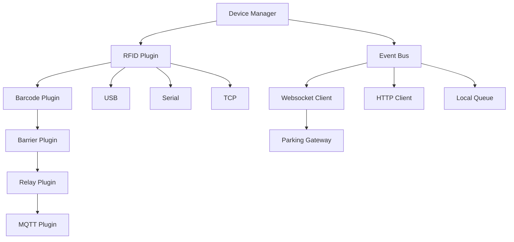
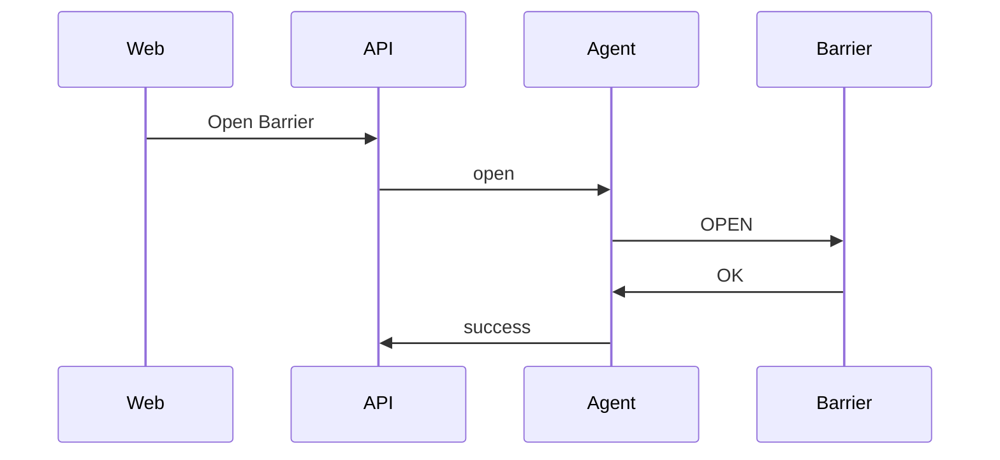
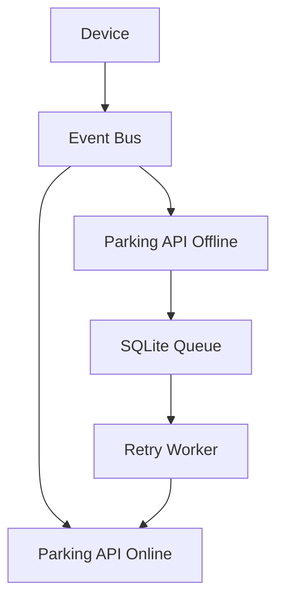

# docs/services/device-agent.md

# Parking Device Agent

## 1. Giới thiệu

`parking-device-agent` là service chịu trách nhiệm giao tiếp với toàn bộ thiết bị vật lý.

Service này chạy độc lập với `parking-api`.

Nó có thể được cài:

* Trên máy chủ trung tâm
* Trên máy bảo vệ
* Trên Raspberry Pi
* Trên Mini PC
* Trên Jetson Nano

---

# 2. Mục tiêu thiết kế

Device Agent phải:

* Hoạt động offline
* Tự reconnect thiết bị
* Tự reconnect API
* Hỗ trợ plugin
* Hỗ trợ nhiều loại thiết bị
* Chạy đa nền tảng
* Có thể chạy nhiều instance

---

# 3. Công nghệ

| Thành phần | Công nghệ         |
| ---------- | ----------------- |
| Language   | Python            |
| Framework  | AsyncIO           |
| HTTP       | FastAPI           |
| Websocket  | websockets        |
| MQTT       | paho-mqtt         |
| Serial     | pyserial          |
| USB HID    | hidapi            |
| Logging    | structlog         |
| Config     | Pydantic Settings |

---

# 4. Kiến trúc



---

# 5. Cấu trúc thư mục

```text
parking-device-agent/

├── app/

│

├── main.py

│

├── config/

│ ├── settings.py

│ └── logging.py

│

├── core/

│ ├── device_manager.py

│ ├── plugin_manager.py

│ ├── event_bus.py

│ └── queue_manager.py

│

├── api/

│ ├── health.py

│ └── devices.py

│

├── websocket/

│ └── client.py

│

├── plugins/

│

│ ├── rfid/

│ │

│ ├── keyboard/

│ │ ├── plugin.py

│ │ └── config.py

│ │

│ ├── serial/

│ │ ├── plugin.py

│ │ └── config.py

│ │

│ ├── tcp/

│ │ ├── plugin.py

│ │ └── config.py

│

│ ├── barrier/

│

│ ├── mqtt/

│

│ └── mock/

│

├── queue/

├── tests/

├── Dockerfile

└── requirements.txt
```

---

# 6. Các loại thiết bị hỗ trợ

## RFID Reader

### USB Keyboard

Thiết bị giả lập bàn phím.

Ví dụ:

```text
ACR122U

ZKTeco KR101

Mifare USB Reader
```

Nguyên lý:

```text
Quẹt thẻ

↓

Reader

↓

Gửi chuỗi ký tự

↓

Device Agent

↓

Parking API
```

---

### Serial

Ví dụ:

```text
COM1

COM2

/dev/ttyUSB0

/dev/ttyS0
```

Config:

```yaml
port: /dev/ttyUSB0

baudrate: 9600

timeout: 1
```

---

### TCP/IP

Ví dụ:

```text
192.168.10.50:6000
```

Config:

```yaml
host: 192.168.10.50

port: 6000
```

---

# 7. Barrier

Hỗ trợ:

```text
RS485

TCP/IP

MQTT

HTTP API

Relay Controller
```

---

Lệnh:

```text
OPEN

CLOSE

STOP

EMERGENCY_OPEN
```

---

Luồng:



---

# 8. Event Bus

Tất cả thiết bị giao tiếp qua Event Bus nội bộ.

Ví dụ:

```text
card_scanned

barrier_opened

barrier_closed

device_online

device_offline

error
```

---

Event:

```json
{
  "event":"card_scanned",

  "device_id":"xxx",

  "payload":{

    "uid":"04A12345"

  },

  "created_at":"..."
}
```

---

# 9. Queue Offline

Agent phải hoạt động được khi mất mạng.

Ví dụ:

```text
RFID Reader

↓

Device Agent

↓

Parking API OFFLINE

↓

Queue Local

↓

Chờ reconnect

↓

Đẩy lại event
```

---

Sơ đồ:



---

# 10. Queue Storage

Queue local dùng:

```text
SQLite
```

Bảng:

```sql
CREATE TABLE event_queue (

    id TEXT PRIMARY KEY,

    event_type TEXT,

    payload JSON,

    retry_count INTEGER,

    created_at TIMESTAMP

);
```

---

# 11. Plugin System

Đây là phần quan trọng nhất.

Mỗi plugin phải implement:

```python
class DevicePlugin:

    async def connect():

        pass

    async def disconnect():

        pass

    async def read():

        pass

    async def write():

        pass

    async def health():

        pass
```

---

# 12. RFID Plugin

Ví dụ:

```python
class RFIDPlugin(DevicePlugin):

    async def connect():

        ...

    async def read():

        return {

            "uid":"04A12345"

        }
```

---

Khi quẹt:

```text
Reader

↓

RFID Plugin

↓

Event Bus

↓

WebSocket Client

↓

Parking Gateway
```

---

# 13. WebSocket Client

Agent duy trì kết nối:

```text
ws://parking-gateway:8300/ws/device-agent
```

---

Handshake:

```json
{
  "agent_id":"gate-01",

  "version":"1.0.0",

  "hostname":"guard-pc",

  "platform":"linux"
}
```

---

Khi online:

```json
{
  "event":"agent.online",

  "payload":{

      "agent_id":"gate-01"

  }
}
```

---

# 14. Heartbeat

Mỗi:

```text
30 giây
```

Agent gửi:

```json
{
  "event":"heartbeat",

  "payload":{

      "cpu":12,

      "memory":28,

      "temperature":52,

      "uptime":3600

  }
}
```

---

API cập nhật:

```text
devices.last_seen_at
```

---

# 15. Health Check

API nội bộ:

```http
GET /health
```

Response:

```json
{
    "status":"ok"
}
```

---

Chi tiết:

```http
GET /health/full
```

Response:

```json
{
    "agent":"ok",

    "devices":{

        "rfid-1":"online",

        "barrier-1":"online"

    },

    "api":"online"
}
```

---

# 16. File cấu hình

```yaml
agent:

  id: gate-01

  name: Cổng số 1

server:

  api_url: http://parking-api:8000

  websocket_url: ws://parking-gateway:8300/ws/device-agent

queue:

  type: sqlite

  path: ./data/queue.db

heartbeat:

  interval: 30
```

---

# 17. Cấu hình RFID

Ví dụ USB Keyboard

```yaml
devices:

  - id: rfid-01

    name: RFID Entry

    plugin: keyboard

    enabled: true
```

---

Ví dụ Serial

```yaml
devices:

  - id: rfid-01

    plugin: serial

    port: /dev/ttyUSB0

    baudrate: 9600

    timeout: 1
```

---

Ví dụ TCP

```yaml
devices:

  - id: rfid-01

    plugin: tcp

    host: 192.168.10.50

    port: 6000
```

---

# 18. Dockerfile

```dockerfile
FROM python:3.13-slim

WORKDIR /app

RUN apt update && apt install -y \

    gcc \

    libusb-1.0-0 \

    libusb-dev

COPY requirements.txt .

RUN pip install -r requirements.txt

COPY . .

CMD [

"python",

"-m",

"app.main"

]
```

---

# 19. Docker Compose

```yaml
device-agent:

  build:

    context: ./apps/parking-device-agent

  restart: unless-stopped

  privileged: true

  devices:

    - /dev/bus/usb

    - /dev/ttyUSB0

  volumes:

    - ./config:/app/config

    - ./data:/app/data

  environment:

    TZ: Asia/Ho_Chi_Minh
```

---

# 20. Chạy nhiều Agent

Có thể chạy:

```text
Guard PC 1

├── gate-01

└── gate-02

Guard PC 2

├── gate-03

└── gate-04
```

Tất cả cùng kết nối về:

```text
parking-api
```

---

# 21. Chế độ Mock

Phục vụ phát triển.

Plugin:

```text
mock
```

Tự sinh:

* UID thẻ
* Mở barrier giả lập
* Thiết bị online/offline
* Event giả lập

Ví dụ:

```json
{
    "uid":"MOCK-000001"
}
```

---

# 22. Roadmap

## MVP

Hỗ trợ:

* USB Keyboard RFID
* Serial RFID
* TCP RFID
* Barrier TCP
* Queue Offline
* WebSocket

---

## Version 1

Thêm:

* MQTT
* RS485
* Relay Controller
* Device Dashboard
* OTA Update

---

## Version 2

Thêm:

* Wiegand Controller
* Zigbee
* BLE
* Edge AI
* Auto discovery thiết bị

---

# 23. Tổng kết

`parking-device-agent` là tầng giao tiếp phần cứng của toàn hệ thống.

Nó có trách nhiệm:

* Đọc RFID
* Điều khiển Barrier
* Đồng bộ trạng thái thiết bị
* Hoạt động offline
* Đồng bộ event về Parking API
* Hỗ trợ plugin để mở rộng thiết bị mới

Mọi loại đầu đọc thẻ hoặc barrier mới đều nên được triển khai dưới dạng plugin thay vì sửa mã nguồn lõi.
