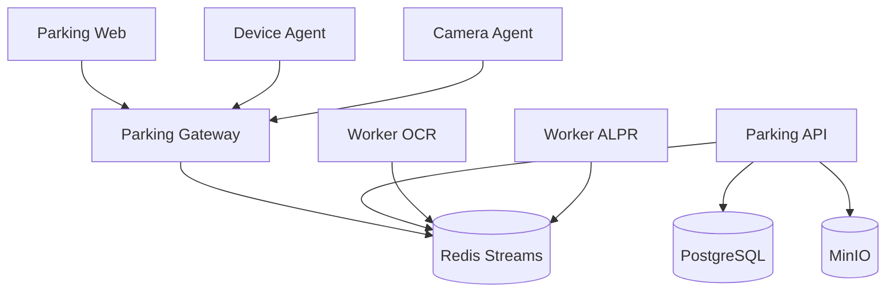
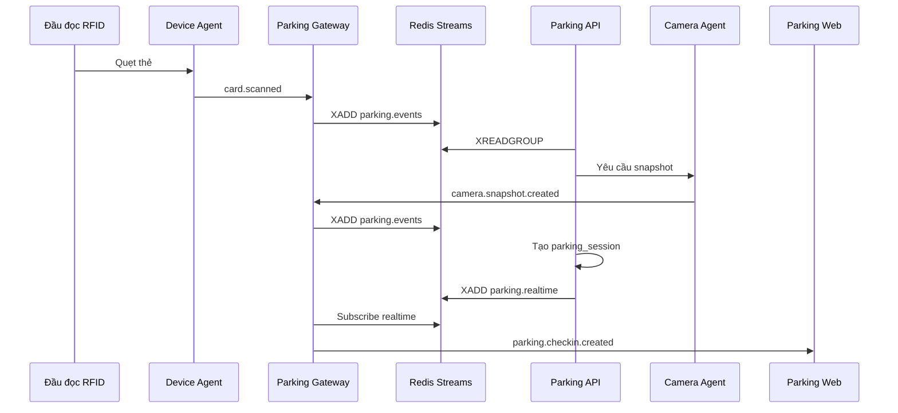
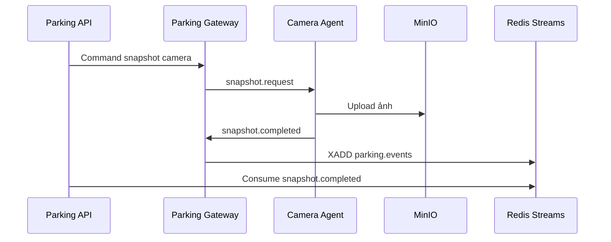
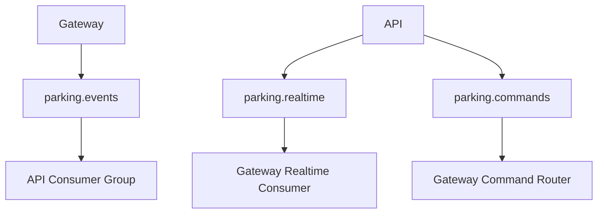
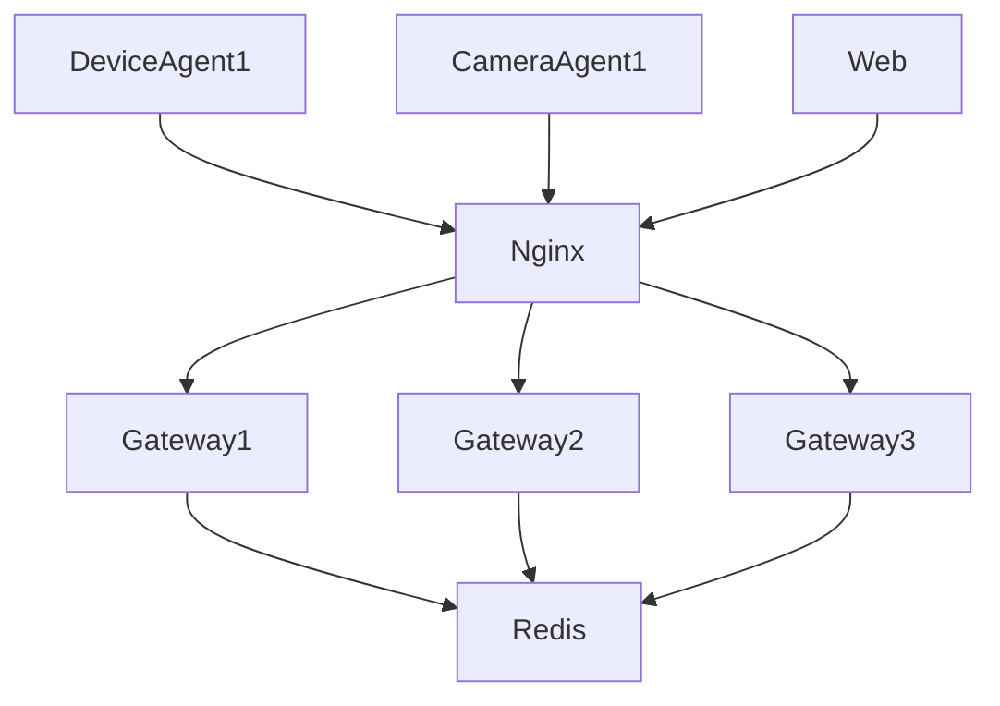

# docs/services/gateway.md

# Parking Gateway Service

## 1. Giới thiệu

`parking-gateway` là service trung gian chịu trách nhiệm quản lý kết nối realtime giữa các thành phần trong hệ thống Parking System.

Service này không xử lý nghiệp vụ chính như check-in, check-out hay tính phí. Nhiệm vụ chính của nó là:

* Quản lý WebSocket
* Quản lý kết nối từ Device Agent
* Quản lý kết nối từ Camera Agent
* Quản lý kết nối realtime từ Parking Web
* Nhận event từ thiết bị
* Đẩy event vào Redis Streams
* Broadcast realtime event về Web
* Theo dõi trạng thái online/offline của agent
* Heartbeat
* Retry / replay event khi cần

---

# 2. Vì sao cần Parking Gateway?

Nếu để `device-agent`, `camera-agent`, `parking-web` kết nối trực tiếp vào `parking-api`, thì `parking-api` sẽ phải làm quá nhiều việc:

```text
parking-api
├── Business logic
├── Database
├── Auth
├── WebSocket
├── Agent connection
├── Heartbeat
├── Realtime broadcast
└── Event routing
```

Điều này không tốt khi hệ thống mở rộng.

Thiết kế đúng hơn:

```text
parking-api
├── Business logic
├── Database
├── Auth
└── API

parking-gateway
├── WebSocket
├── Agent connection
├── Heartbeat
├── Event routing
└── Realtime broadcast
```

---

# 3. Kiến trúc tổng quan



---

# 4. Vai trò của Gateway

## 4.1. Nhận kết nối từ Web

Parking Web kết nối realtime đến:

```text
ws://parking-gateway:8300/ws/web
```

Web nhận các event như:

```text
parking.checkin.created
parking.checkout.completed
device.online
device.offline
camera.online
camera.offline
barrier.opened
barrier.closed
```

---

## 4.2. Nhận kết nối từ Device Agent

Device Agent kết nối đến:

```text
ws://parking-gateway:8300/ws/device-agent
```

Device Agent gửi event:

```text
card.scanned
barrier.opened
barrier.closed
device.online
device.offline
device.error
```

---

## 4.3. Nhận kết nối từ Camera Agent

Camera Agent kết nối đến:

```text
ws://parking-gateway:8300/ws/camera-agent
```

Camera Agent gửi event:

```text
camera.online
camera.offline
camera.snapshot.created
camera.motion.detected
camera.record.started
camera.record.stopped
```

---

## 4.4. Redis Streams

Gateway không gọi trực tiếp business logic trong API.

Gateway ghi event vào Redis Streams.

Ví dụ:

```text
stream: parking.events
```

Parking API sẽ consume stream này để xử lý nghiệp vụ.

---

# 5. Công nghệ

| Thành phần   | Công nghệ         |
| ------------ | ----------------- |
| Language     | Python            |
| Framework    | FastAPI           |
| WebSocket    | FastAPI WebSocket |
| Event Stream | Redis Streams     |
| Validation   | Pydantic          |
| Logging      | structlog         |
| Auth         | JWT / Agent Token |
| Health Check | HTTP API          |

---

# 6. Cấu trúc thư mục

```text
parking-gateway/

├── app/
│   ├── main.py
│
│   ├── config/
│   │   ├── settings.py
│   │   └── logging.py
│
│   ├── api/
│   │   ├── health.py
│   │   └── status.py
│
│   ├── websocket/
│   │   ├── web_socket.py
│   │   ├── device_agent_socket.py
│   │   ├── camera_agent_socket.py
│   │   └── connection_manager.py
│
│   ├── events/
│   │   ├── event_schema.py
│   │   ├── event_router.py
│   │   ├── event_publisher.py
│   │   └── event_consumer.py
│
│   ├── agents/
│   │   ├── agent_manager.py
│   │   ├── heartbeat_manager.py
│   │   └── session_registry.py
│
│   ├── redis/
│   │   ├── redis_client.py
│   │   ├── streams.py
│   │   └── pubsub.py
│
│   └── utils/
│
├── tests/
├── Dockerfile
└── requirements.txt
```

---

# 7. Luồng quẹt thẻ RFID



---

# 8. Luồng camera snapshot



---

# 9. Event format chuẩn

Tất cả event đi qua Gateway nên dùng format chung.

```json
{
  "event_id": "uuid",
  "event_type": "card.scanned",
  "source": "device-agent",
  "source_id": "device-agent-gate-01",
  "site_id": "main-site",
  "gate_id": "gate-entry-01",
  "device_id": "rfid-entry-01",
  "payload": {
    "card_uid": "04A12345"
  },
  "created_at": "2026-06-17T09:30:00+07:00"
}
```

---

# 10. Danh sách event chính

## 10.1. Device Event

```text
device.online
device.offline
device.error
device.heartbeat
card.scanned
barrier.opened
barrier.closed
barrier.error
```

---

## 10.2. Camera Event

```text
camera.online
camera.offline
camera.error
camera.heartbeat
camera.snapshot.requested
camera.snapshot.completed
camera.motion.detected
camera.record.started
camera.record.stopped
```

---

## 10.3. Parking Event

```text
parking.checkin.created
parking.checkout.completed
parking.session.cancelled
parking.payment.completed
parking.warning.created
```

---

## 10.4. Web Event

```text
web.connected
web.disconnected
web.command.sent
```

---

# 11. Redis Streams

## 11.1. parking.events

Dùng cho event nghiệp vụ cần xử lý.

Ví dụ:

```text
card.scanned
camera.snapshot.completed
barrier.opened
```

---

## 11.2. parking.realtime

Dùng cho event đẩy realtime về Web.

Ví dụ:

```text
parking.checkin.created
device.online
camera.offline
```

---

## 11.3. parking.commands

Dùng cho command từ API đến Agent.

Ví dụ:

```text
camera.snapshot.request
barrier.open.request
device.restart.request
```

---

# 12. Redis Consumer Group

Parking API consume:

```text
parking.events
```

Gateway consume:

```text
parking.realtime
parking.commands
```

Worker consume:

```text
parking.tasks
```

---

Sơ đồ:



---

# 13. Agent Connection Manager

Gateway lưu trạng thái agent trong memory và Redis.

Thông tin agent:

```json
{
  "agent_id": "device-agent-gate-01",
  "agent_type": "device",
  "hostname": "guard-pc-01",
  "ip_address": "192.168.10.20",
  "version": "1.0.0",
  "status": "online",
  "last_seen_at": "2026-06-17T09:30:00+07:00"
}
```

---

# 14. Heartbeat

Agent gửi heartbeat mỗi:

```text
30 giây
```

Payload:

```json
{
  "event_type": "device.heartbeat",
  "source": "device-agent",
  "source_id": "device-agent-gate-01",
  "payload": {
    "cpu_percent": 12,
    "memory_percent": 28,
    "uptime_seconds": 3600,
    "devices": [
      {
        "device_id": "rfid-entry-01",
        "status": "online"
      }
    ]
  }
}
```

Nếu quá:

```text
90 giây
```

không có heartbeat, Gateway đánh dấu agent là:

```text
offline
```

---

# 15. Command routing

Gateway nhận command từ Redis Stream `parking.commands`, sau đó chuyển đến Agent phù hợp.

Ví dụ mở barrier:

```json
{
  "event_id": "uuid",
  "event_type": "barrier.open.request",
  "target_agent_id": "device-agent-gate-01",
  "target_device_id": "barrier-entry-01",
  "payload": {
    "duration_ms": 1500
  }
}
```

Gateway gửi qua WebSocket đến Device Agent:

```json
{
  "command_id": "uuid",
  "command": "barrier.open",
  "device_id": "barrier-entry-01",
  "payload": {
    "duration_ms": 1500
  }
}
```

---

# 16. Auth

## 16.1. Web Auth

Parking Web dùng JWT của người dùng.

Header:

```text
Authorization: Bearer <access_token>
```

---

## 16.2. Agent Auth

Agent dùng token riêng.

Header khi kết nối WebSocket:

```text
X-Agent-ID: device-agent-gate-01
X-Agent-Token: xxxxx
```

Không dùng tài khoản user cho Agent.

---

# 17. API nội bộ

## Health check

```http
GET /health
```

Response:

```json
{
  "status": "ok"
}
```

---

## Danh sách connection

```http
GET /internal/connections
```

Response:

```json
{
  "web_clients": 3,
  "device_agents": 2,
  "camera_agents": 4
}
```

---

## Danh sách agent

```http
GET /internal/agents
```

Response:

```json
[
  {
    "agent_id": "device-agent-gate-01",
    "agent_type": "device",
    "status": "online",
    "last_seen_at": "2026-06-17T09:30:00+07:00"
  }
]
```

---

# 18. File cấu hình

```env
APP_NAME=parking-gateway
APP_ENV=production
APP_PORT=8300

REDIS_URL=redis://redis:6379/0

GATEWAY_PUBLIC_URL=ws://localhost:8300

AGENT_TOKEN_SECRET=CHANGE_ME
JWT_PUBLIC_KEY=CHANGE_ME

HEARTBEAT_INTERVAL=30
HEARTBEAT_TIMEOUT=90
```

---

# 19. Dockerfile

```dockerfile
FROM python:3.13-slim

WORKDIR /app

COPY requirements.txt .

RUN pip install -r requirements.txt

COPY . .

EXPOSE 8300

CMD ["uvicorn", "app.main:app", "--host", "0.0.0.0", "--port", "8300"]
```

---

# 20. Docker Compose

```yaml
parking-gateway:
  build:
    context: ./apps/parking-gateway
  restart: unless-stopped
  env_file:
    - .env
  ports:
    - "8300:8300"
  depends_on:
    - redis
```

---

# 21. Scale Gateway

MVP có thể chạy 1 Gateway.

Production có thể chạy nhiều Gateway:



Lưu ý:

* WebSocket cần sticky session nếu Agent giữ kết nối lâu.
* Redis dùng để đồng bộ trạng thái agent giữa nhiều Gateway.
* Command routing cần biết Agent đang kết nối với Gateway nào.

---

# 22. Chế độ phát triển

Có thể bật mock event:

```env
MOCK_GATEWAY_EVENTS=true
```

Gateway tự sinh:

```text
card.scanned
camera.online
device.online
parking.checkin.created
```

---

# 23. Roadmap

## MVP

* WebSocket cho Web
* WebSocket cho Device Agent
* WebSocket cho Camera Agent
* Redis Streams
* Heartbeat
* Agent status
* Command routing

---

## Version 1

* Multi Gateway
* Sticky session support
* MQTT bridge
* Event replay
* Agent token rotation
* Rate limit

---

## Version 2

* Kafka / NATS support
* Edge Gateway
* Offline site mode
* Multi-tenant event routing
* High Availability Gateway Cluster

---

# 24. Tổng kết

`parking-gateway` là lớp realtime và event routing của hệ thống.

Nó giúp tách biệt:

```text
Business Logic  → parking-api
Realtime/Event  → parking-gateway
Hardware Agent  → device-agent / camera-agent
AI Processing   → parking-worker
```

Thiết kế này giúp hệ thống:

* Dễ scale
* Dễ debug
* Ít phụ thuộc chéo
* Không làm nặng Parking API
* Dễ hỗ trợ nhiều bãi xe, nhiều cổng, nhiều camera
