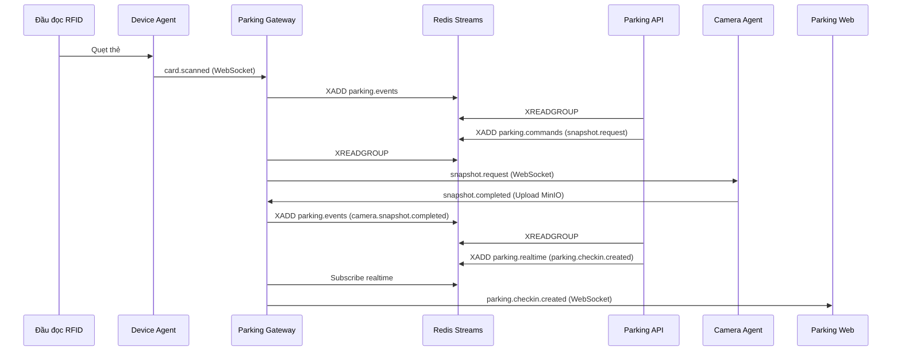

# docs/services/web.md

# Parking Web

## 1. Giới thiệu

`parking-web` là giao diện người dùng của hệ thống.

Nó chịu trách nhiệm:

* Dashboard realtime
* Check-in xe
* Check-out xe
* Quản lý xe
* Quản lý thẻ RFID
* Quản lý camera
* Quản lý thiết bị
* Báo cáo
* Cấu hình hệ thống

---

# 2. Công nghệ

| Thành phần | Công nghệ   |
| ---------- | ----------- |
| Framework  | Vue 3       |
| Build Tool | Vite        |
| UI         | TailwindCSS |
| State      | Pinia       |
| Router     | Vue Router  |
| HTTP       | Axios       |
| Realtime   | WebSocket   |
| Table      | AG Grid     |
| Chart      | ECharts     |

---

# 3. Cấu trúc thư mục

```text
parking-web/

├── src/

│

├── App.vue

├── main.ts

│

├── router/

│

├── stores/

│ ├── auth.ts

│ ├── websocket.ts

│ ├── dashboard.ts

│ ├── parking.ts

│ └── devices.ts

│

├── layouts/

│ ├── DefaultLayout.vue

│ └── FullScreenLayout.vue

│

├── pages/

│

│ ├── Login/

│

│ ├── Dashboard/

│

│ ├── Parking/

│ │

│ ├── Checkin/

│ │

│ ├── Checkout/

│ │

│ └── History/

│

│ ├── Vehicles/

│

│ ├── Cards/

│

│ ├── Owners/

│

│ ├── Cameras/

│

│ ├── Devices/

│

│ ├── Reports/

│

│ └── Settings/

│

├── components/

│

├── services/

│

├── composables/

│

├── types/

│

└── utils/
```

---

# 4. Layout tổng thể

```text
┌───────────────────────────────────────────────┐

│ Logo                      User / Notification │

├─────────────┬─────────────────────────────────┤

│             │                                 │

│ Dashboard   │                                 │

│ Check-in    │                                 │

│ Check-out   │                                 │

│ History     │                                 │

│             │                                 │

│ Vehicles    │                                 │

│ Cards       │                                 │

│ Owners      │                                 │

│ Cameras     │                                 │

│ Devices     │                                 │

│ Reports     │                                 │

│ Settings    │                                 │

│             │                                 │

├─────────────┴─────────────────────────────────┤

│ Footer                                        │

└───────────────────────────────────────────────┘
```

---

# 5. Dashboard

Dashboard hiển thị realtime.

---

## Card thống kê

```text
┌─────────────┐

│ Xe đang gửi │

│     132     │

└─────────────┘

┌─────────────┐

│ Xe vào hôm nay │

│      850       │

└─────────────┘

┌─────────────┐

│ Doanh thu │

│ 12.500.000 │

└─────────────┘
```

---

## Biểu đồ

### Theo giờ

```text
8h

██████████

9h

██████████████

10h

██████
```

---

### Theo ngày

```text
Mon ████

Tue ███████

Wed ██████████

Thu █████
```

---

## Thiết bị realtime

```text
Camera Entry     ● Online

Camera Exit      ● Online

RFID Entry       ● Online

RFID Exit        ● Online

Barrier Entry    ● Online
```

---

# 6. Màn hình Check-in

Đây là màn hình quan trọng nhất.

Nó phải:

* Fullscreen
* Cập nhật realtime
* Thao tác nhanh

---

Layout:

```text
┌─────────────────────────────────────────────┐

│ CHECK-IN                                    │

├─────────────────────────────────────────────┤

│                                             │

│       Camera Tổng thể                       │

│                                             │

│                                             │

├─────────────────────┬───────────────────────┤

│ Camera biển số      │ Thông tin             │

│                     │                       │

│                     │ UID:                  │

│                     │                       │

│                     │ 04A12345              │

│                     │                       │

│                     │ Biển số:              │

│                     │                       │

│                     │ 51A12345              │

│                     │                       │

│                     │ Giờ vào               │

│                     │                       │

│                     │ 08:30:00              │

│                     │                       │

│                     │ Người trực            │

│                     │                       │

│                     │ Nguyễn Văn A          │

│                     │                       │

│                     │ [ XÁC NHẬN ]          │

│                     │                       │

└─────────────────────┴───────────────────────┘
```

---

## Luồng



---

# 7. Màn hình Check-out

Layout:

```text
┌─────────────────────────────────────────────┐

│ CHECK-OUT                                   │

├────────────────────┬────────────────────────┤

│                    │                        │

│  Xe vào            │ Xe ra                  │

│                    │                        │

│   Ảnh              │  Ảnh                   │

│                    │                        │

│                    │                        │

├────────────────────┼────────────────────────┤

│ Plate              │ Plate                  │

│                    │                        │

│ 51A12345           │ 51A12345               │

├────────────────────┼────────────────────────┤

│ Giờ vào            │ Giờ ra                 │

│ 08:30              │ 17:00                  │

├────────────────────┴────────────────────────┤

│                                             │

│ Thời gian gửi: 8h 30p                       │

│                                             │

│ Phí: 5.000đ                                │

│                                             │

│ [ XÁC NHẬN XE RA ]                         │

│                                             │

└─────────────────────────────────────────────┘
```

---

# 8. Lịch sử gửi xe

Hiển thị dạng bảng.

```text
┌──────────────────────────────────────────────┐

Mã

Biển số

Giờ vào

Giờ ra

Trạng thái

Phí

Thao tác

──────────────────────────────────────────────

001

51A12345

08:30

17:00

Completed

5.000

[Xem]

──────────────────────────────────────────────
```

---

Bộ lọc:

```text
Ngày

Từ ngày

Đến ngày

Biển số

UID

Nhân viên

Khu vực

Trạng thái
```

---

# 9. Quản lý RFID

Danh sách:

```text
UID

Loại

Chủ xe

Xe

Trạng thái

Ngày cấp

Ngày hết hạn
```

---

Chi tiết:

```text
UID

04A12345

Trạng thái

ACTIVE

Gán cho:

Nguyễn Văn A

Xe:

51A12345

Lịch sử:

08:30 Checkin

17:00 Checkout
```

---

# 10. Quản lý Camera

Layout:

```text
┌────────────────────────────┐

Camera Entry

[ Live Preview ]

FPS: 10

Status: Online

RTSP: ....

[ Snapshot ]

[ Restart ]

└────────────────────────────┘
```

---

Chế độ Grid:

```text
┌──────┬──────┐

│ Cam1 │ Cam2 │

├──────┼──────┤

│ Cam3 │ Cam4 │

└──────┴──────┘
```

---

# 11. Quản lý Device

```text
Tên

Loại

Kết nối

Status

Last Seen

Action
```

---

Ví dụ:

```text
RFID Entry

USB

Online

08:30:00

[Test]

[Restart]
```

---

# 12. Quản lý Vehicle

Danh sách:

```text
Biển số

Loại xe

Chủ xe

RFID

Trạng thái
```

---

Chi tiết:

```text
Biển số:

51A12345

Loại:

Xe máy

Chủ xe:

Nguyễn Văn A

RFID:

04A12345

Ảnh:

[image]
```

---

# 13. Realtime

WebSocket:

```text
ws://parking-gateway:8300/ws/web
```

---

Store:

```text
websocketStore

dashboardStore

parkingStore

deviceStore
```

---

Event:

```json
{

    "event":"parking.checkin",

    "data":{

        "session_id":"xxx",

        "plate":"51A12345"

    }

}
```

---

Sự kiện:

```text
parking.checkin

parking.checkout

device.online

device.offline

camera.online

camera.offline

motion.detected

barrier.opened

barrier.closed
```

---

# 14. Route

```text
/

/login

/dashboard

/checkin

/checkout

/history

/vehicles

/cards

/owners

/cameras

/devices

/reports

/settings
```

---

# 15. Quyền truy cập

## Guard

Được:

```text
Dashboard

Check-in

Check-out

History
```

---

## Supervisor

Được:

```text
Dashboard

History

Reports

Devices

Cameras
```

---

## Admin

Được:

```text
Toàn quyền
```

---

# 16. Responsive

Hỗ trợ:

```text
Desktop

Laptop

Tablet

Mobile
```

---

Tuy nhiên:

```text
Check-in

Check-out
```

không khuyến khích dùng mobile.

Nên fullscreen trên:

```text
1920x1080

1366x768
```

---

# 17. Theme

Hỗ trợ:

```text
Light

Dark
```

---

Màu sắc đề xuất:

```text
Primary:

#2563EB

Success:

#10B981

Warning:

#F59E0B

Danger:

#EF4444
```

---

# 18. Dockerfile

```dockerfile
FROM node:22-alpine

WORKDIR /app

COPY package*.json ./

RUN npm install

COPY . .

RUN npm run build

EXPOSE 3000

CMD ["npm","run","preview"]
```

---

# 19. Docker Compose

```yaml
parking-web:

  build:

    context: ./apps/parking-web

  ports:

    - "3000:3000"

  environment:

    VITE_API_URL: http://parking-api:8000

  restart: unless-stopped
```

---

# 20. Roadmap

## MVP

* Login

* Dashboard

* Check-in

* Check-out

* History

* Vehicles

* RFID Cards

---

## Version 1

* Camera Grid

* Device Monitor

* Reports

* Dark Mode

* Realtime Dashboard

---

## Version 2

* Mobile App

* Notification Center

* AI Alert

* Multi Parking Site

* Multi Language

---

# 21. Tổng kết

`parking-web` là giao diện điều khiển trung tâm của hệ thống.

Nguyên tắc thiết kế:

* Tối ưu cho nhân viên bảo vệ.
* Check-in / Check-out phải thao tác cực nhanh.
* Mọi thay đổi được cập nhật realtime qua WebSocket.
* Không xử lý nghiệp vụ phức tạp trên frontend.
* Toàn bộ business logic nằm ở `parking-api`.

Mục tiêu cuối cùng:

Một nhân viên bảo vệ có thể:

* Quẹt thẻ
* Xem ảnh xe
* Xác nhận
* Hoàn tất giao dịch

trong vòng **1~2 giây**.
