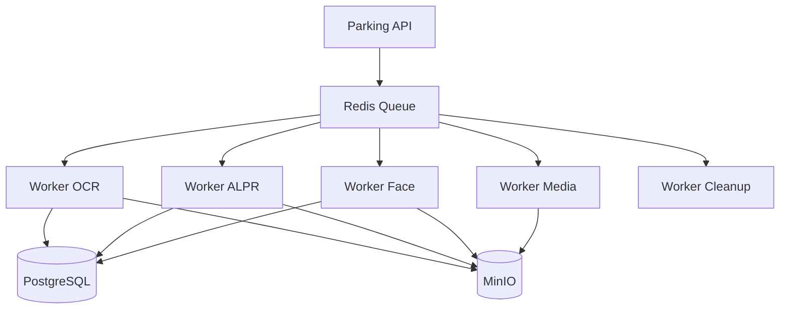
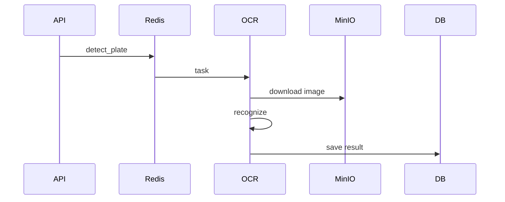
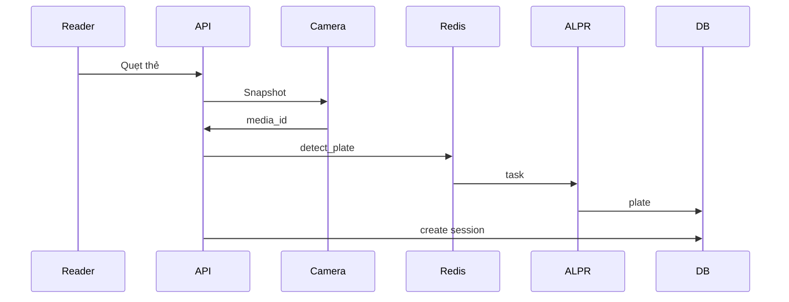
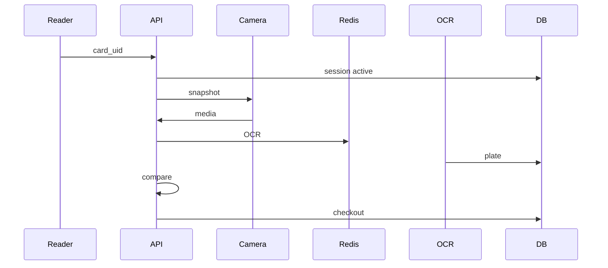

# docs/services/worker.md

# Parking Worker Service

## 1. Giới thiệu

`parking-worker` là tập hợp các service xử lý bất đồng bộ (Background Job).

Worker không giao tiếp trực tiếp với người dùng.

Nhiệm vụ chính:

* OCR biển số
* Nhận diện biển số (ALPR)
* So khớp ảnh xe vào/ra
* Face Detection
* Face Recognition
* Xử lý ảnh
* Sinh thumbnail
* Nén video
* Cleanup dữ liệu

---

# 2. Tại sao không nên chỉ có 1 Worker?

Không nên thiết kế:

```text
parking-worker

├── OCR

├── ALPR

├── Face

├── Cleanup

└── Thumbnail
```

Vì:

* OCR có thể dùng CPU
* Face Recognition thường cần GPU
* Cleanup không cần GPU
* ALPR có thể scale riêng

---

Nên thiết kế:

```text
parking-worker-ocr

parking-worker-alpr

parking-worker-face

parking-worker-media

parking-worker-cleanup
```

---

# 3. Kiến trúc



---

# 4. Công nghệ

| Thành phần | Công nghệ   |
| ---------- | ----------- |
| Queue      | Redis       |
| Task       | Celery      |
| OCR        | PaddleOCR   |
| ALPR       | OpenALPR    |
| AI         | YOLO        |
| Face       | InsightFace |
| Media      | OpenCV      |
| GPU        | CUDA        |

---

# 5. Cấu trúc thư mục

```text
parking-worker/

├── app/

│

├── celery_app.py

│

├── config/

│ └── settings.py

│

├── tasks/

│

│ ├── ocr/

│ │

│ ├── alpr/

│ │

│ ├── face/

│ │

│ ├── media/

│ │

│ └── cleanup/

│

├── services/

│

├── utils/

│

├── tests/

│

├── Dockerfile

└── requirements.txt
```

---

# 6. Queue

Queue dùng Redis.

Tên queue:

```text
ocr

alpr

face

media

cleanup
```

---

Ví dụ:

```python
celery.send_task(

    "ocr.detect_plate",

    args=[media_id]

)
```

---

# 7. Worker OCR

## Chức năng

OCR đọc ký tự trên biển số.

Input:

```text
Ảnh biển số
```

Output:

```text
51A12345
```

---

## Thư viện

```text
PaddleOCR
```

---

Luồng:



---

Kết quả:

```json
{
    "plate":"51A12345",

    "confidence":0.98
}
```

---

# 8. Worker ALPR

ALPR = Automatic License Plate Recognition.

Bao gồm:

### Bước 1

Detect biển số.

```text
Ảnh xe

↓

YOLO

↓

Bounding Box
```

---

### Bước 2

Crop.

```text
Crop biển số
```

---

### Bước 3

OCR.

```text
PaddleOCR

↓

51A12345
```

---

Kết quả:

```json
{
    "plate":"51A12345",

    "confidence":0.97,

    "bbox":[

        100,

        120,

        300,

        180

    ]
}
```

---

# 9. Worker Face

## Mục tiêu

Tùy chọn.

Có thể dùng cho:

* Nhận diện tài xế
* Nhân viên
* Blacklist
* VIP

---

Thư viện:

```text
InsightFace
```

---

Input:

```text
Ảnh khuôn mặt
```

---

Output:

```json
{
    "person_id":"xxx",

    "similarity":0.89
}
```

---

# 10. Worker Media

Xử lý ảnh/video.

---

## Thumbnail

Ví dụ:

```text
1920x1080

↓

Resize

↓

320x180
```

---

## Watermark

Ví dụ:

```text
17/06/2026

09:30:20

Gate: Entry 01
```

---

## Compress

Video:

```text
H264

↓

H265
```

---

Ảnh:

```text
JPEG 95

↓

JPEG 80
```

---

# 11. Worker Cleanup

Dọn dữ liệu cũ.

---

Ví dụ:

```text
Video > 30 ngày

↓

Delete
```

---

```text
Snapshot > 180 ngày

↓

Delete
```

---

Luồng:

```mermaid
graph TD

Cron

↓

Cleanup Worker

↓

PostgreSQL

↓

MinIO

↓

Delete Object
```

---

# 12. Model OCR

Thư mục:

```text
models/

├── paddleocr/

│

├── det/

│

├── rec/

│

└── cls/
```

---

Model mặc định:

```text
PP-OCRv5
```

---

# 13. Model ALPR

Thư mục:

```text
models/

├── yolo/

│

├── plate-detector.pt

│

└── vehicle-detector.pt
```

---

Có thể hỗ trợ:

```text
YOLOv8

YOLOv9

YOLOv11
```

---

# 14. Model Face

```text
models/

├── insightface/

│

├── buffalo_l

│

└── buffalo_m
```

---

Model:

```text
ArcFace

Buffalo_L

Buffalo_M
```

---

# 15. GPU

Worker hỗ trợ:

```text
CPU

CUDA

ROCm
```

---

Ví dụ:

```yaml
worker-alpr:

  deploy:

    resources:

      reservations:

        devices:

        - driver: nvidia

          count: 1

          capabilities:

          - gpu
```

---

# 16. Dockerfile OCR

```dockerfile
FROM python:3.13-slim

RUN apt update && apt install -y \

    libgl1 \

    libglib2.0-0

WORKDIR /app

COPY requirements.txt .

RUN pip install -r requirements.txt

COPY . .

CMD [

"celery",

"-A",

"app.celery_app",

"worker",

"-Q",

"ocr",

"--loglevel=INFO"

]
```

---

# 17. Dockerfile ALPR GPU

```dockerfile
FROM nvidia/cuda:12.6.2-runtime-ubuntu22.04

WORKDIR /app

RUN apt update && apt install -y \

    python3 \

    python3-pip \

    ffmpeg \

    libgl1

COPY requirements.txt .

RUN pip install -r requirements.txt

COPY . .

CMD [

"celery",

"-A",

"app.celery_app",

"worker",

"-Q",

"alpr",

"--loglevel=INFO"

]
```

---

# 18. Docker Compose

```yaml
worker-ocr:

  build:

    context: ./apps/parking-worker

  command:

    celery -A app.celery_app worker -Q ocr

  restart: unless-stopped

worker-alpr:

  build:

    context: ./apps/parking-worker

  command:

    celery -A app.celery_app worker -Q alpr

  restart: unless-stopped

worker-face:

  build:

    context: ./apps/parking-worker

  command:

    celery -A app.celery_app worker -Q face

  restart: unless-stopped

worker-cleanup:

  build:

    context: ./apps/parking-worker

  command:

    celery -A app.celery_app worker -Q cleanup

  restart: unless-stopped
```

---

# 19. Luồng Check-in



---

# 20. Luồng Check-out



---

# 21. Benchmark đề xuất

## OCR

```text
CPU:

~100-200ms / ảnh

GPU:

~20-50ms / ảnh
```

---

## ALPR

```text
CPU:

~300-800ms / ảnh

GPU:

~50-150ms / ảnh
```

---

## Face Recognition

```text
CPU:

~200ms

GPU:

~30ms
```

---

# 22. Chế độ Mock

Worker hỗ trợ:

```text
MOCK_OCR=true

MOCK_ALPR=true

MOCK_FACE=true
```

Ví dụ:

```json
{
    "plate":"51A12345",

    "confidence":0.99
}
```

---

# 23. Roadmap

## MVP

* OCR biển số
* ALPR
* Thumbnail
* Cleanup

---

## Version 1

* Face Detection
* Face Recognition
* Vehicle Detection
* Motion Detection

---

## Version 2

* Multi GPU
* Triton Inference Server
* Edge AI
* GPU Scheduler
* Distributed Worker

---

# 24. Tổng kết

Worker là tầng AI và xử lý nền của hệ thống.

Nguyên tắc:

* API không chạy AI.
* Camera Agent không chạy AI nặng.
* Tất cả AI phải chạy qua Queue.
* Mỗi tác vụ AI nên là một Worker riêng.

Thiết kế này giúp:

* Dễ scale
* Dễ thay model
* Dễ tận dụng GPU
* Dễ triển khai nhiều máy
* Có thể phát triển thành nền tảng AI Vision hoàn chỉnh trong tương lai.
